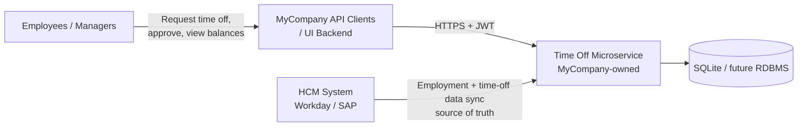
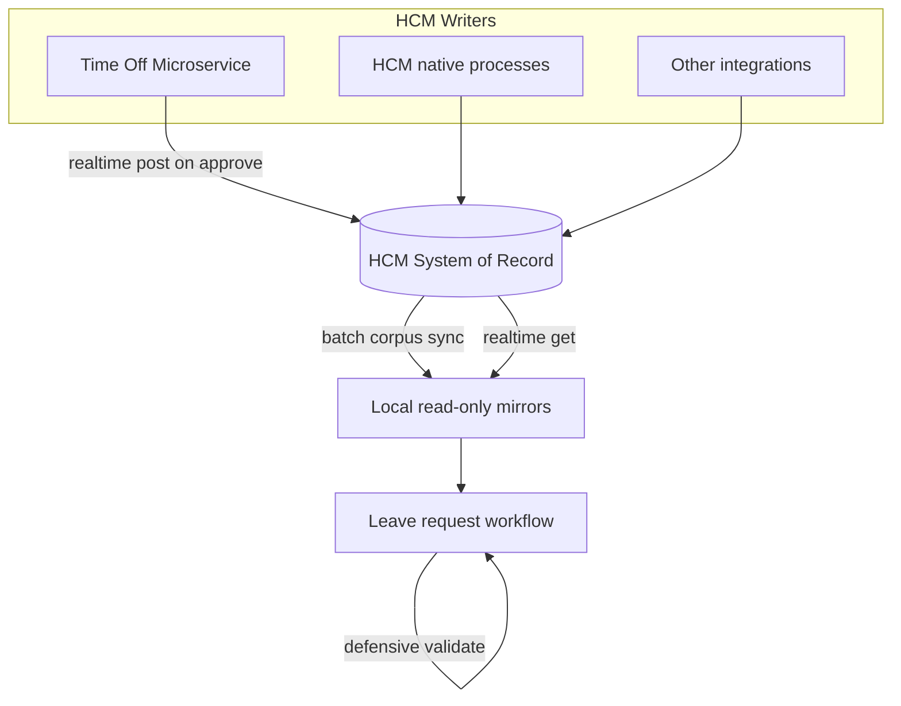
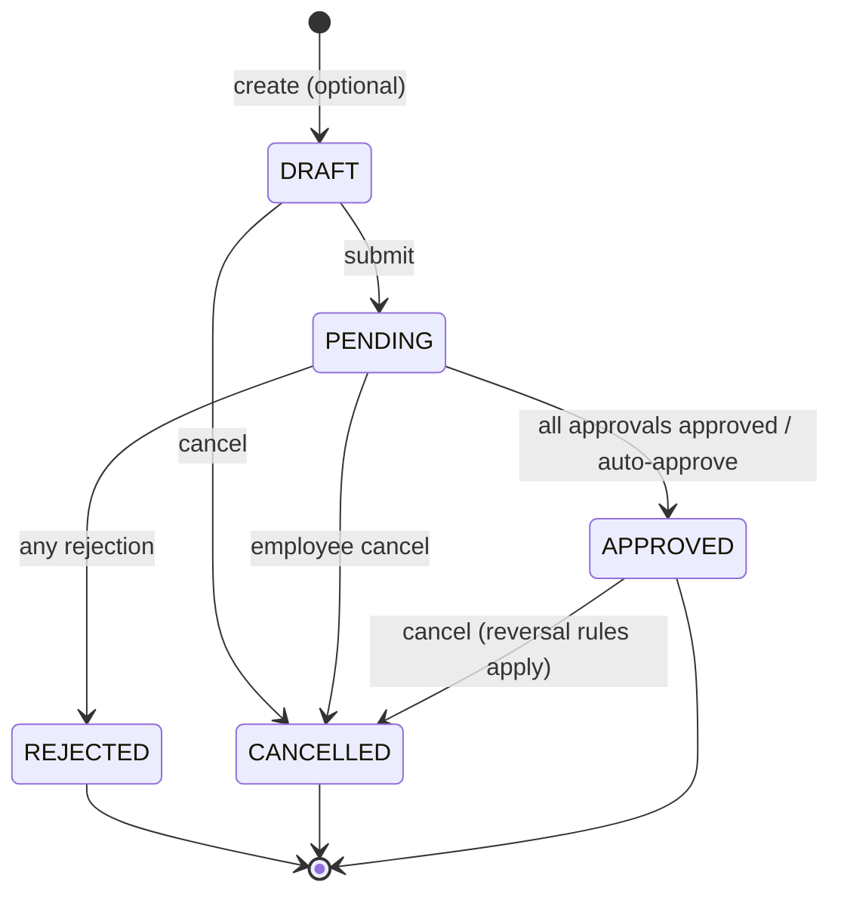

# Time Off Management Microservice — Implementation Specification

**Product owner:** MyCompany  
**Version:** 1.4  
**Status:** Draft  
**Source:** Derived from [trd.md](./trd.md)  
**Stack:** Node.js / TypeScript · Fastify · Prisma · SQLite (dev) · JWT · cron

---

## 1. Purpose

This document translates the Technical Requirements Document (TRD) into an implementation-ready specification for a **MyCompany-owned** microservice. It defines project structure, data models, API contracts, business rules, background jobs, and acceptance tests sufficient to build the service without ambiguity.

MyCompany is the **product owner** of this microservice: MyCompany builds, deploys, and operates it as the time-off workflow boundary within the MyCompany platform. Upstream MyCompany applications consume its API. In this document, **the microservice** refers to the service's runtime behavior; **MyCompany** refers to product ownership, platform context, or organizational responsibility unless stated otherwise.

**Core architectural behavior:** The microservice is the **employee-facing interface for time off**—employees submit leave requests, managers approve them, and participants view balances through this service. The HCM system (e.g. Workday, SAP SuccessFactors) remains the **source of truth for employment data and time-off master data** (balances, accrual, carryover, leave types, policies, ledger history). HCM-sourced fields are synced into read-only local mirrors; they are never created or updated through time-off APIs. The microservice owns **workflow state** (requests, approvals) and a local **pending balance overlay** for in-flight requests.

**Integration constraints:** The microservice is **not the only writer to HCM**—balances may change externally (work anniversaries, year-start refreshes, other integrations). HCM provides both a **realtime API** (point get/send by employee and dimensions such as `locationId`) and a **batch API** (full balance corpus with dimensions). HCM may return errors for invalid dimension combinations or insufficient balance when filing leave, but this is **not guaranteed**; the microservice must validate **defensively** before submit and before posting to HCM.

Where this spec and the TRD conflict, this spec takes precedence for implementation details; the TRD remains authoritative for product scope and business intent.

---

## 2. System Context



### Division of Responsibility

| Concern | System of Record | Employee Interaction |
|---|---|---|
| Submitting and tracking leave requests | Time Off Microservice | Through the microservice API |
| Approval workflow | Time Off Microservice | Through the microservice API |
| Viewing balances, accrual, policies | HCM (synced read-only into microservice) | Through the microservice API (display) |
| Leave balances, accrual, carryover, policies | HCM (Workday, SAP, etc.) | Managed in HCM; synced read-only into the microservice |
| Employment identity, status, org structure | HCM (Workday, SAP, etc.) | Managed in HCM; synced read-only into the microservice |

| Actor | Responsibility |
|---|---|
| MyCompany | Product owner; builds, deploys, and operates the Time Off Microservice |
| HCM (Workday, SAP, etc.) | Source of truth for **employment data** and **time-off master data**—identity, hierarchy, status, balances, accrual, policies, ledger |
| Time Off Microservice | MyCompany-owned **employee interface for time-off workflow**—leave requests, approvals, balance display, HCM integration, audit |
| API clients | MyCompany upstream apps and authorized integrations that present the microservice to employees, managers, and HR admins |

Employees **do not** submit leave requests to HCM in this architecture. They use applications backed by the microservice. The microservice validates requests against synced HCM employment and time-off data but does not authoritatively mutate balances, accrual, or policies.

### HCM Integration Challenges

The microservice is MyCompany's HCM integration boundary for time-off. Operational implications:

| Challenge | Implication for the microservice |
|---|---|
| **Multi-writer HCM** | Balances change in HCM without microservice action (anniversary accrual, year-start refresh, HR adjustments, other integrations). Mirrors are eventually consistent; batch sync + optional realtime refresh required. |
| **Realtime HCM API** | Point operations: get balance or file leave for a specific combination (e.g. `1 day` for `employeeId` + `locationId` + leave type). Used for pre-approve checks and posting approved usage. |
| **Batch HCM API** | Bulk corpus of time-off balances with dimensional keys pushed to or pulled by the microservice. Used for scheduled mirror refresh and reconciliation baselines. |
| **Unreliable HCM rejection** | HCM may error on invalid dimensions or insufficient balance when filing leave, but not always. **Defensive local validation is mandatory**; HCM errors are supplementary. |



---

## 3. Project Structure

```
timeoff-service/
├── prisma/
│   ├── schema.prisma
│   ├── migrations/
│   └── seed.ts
├── src/
│   ├── app.ts                    # Fastify bootstrap
│   ├── config/
│   │   └── env.ts                # Validated environment config
│   ├── plugins/
│   │   ├── prisma.ts
│   │   ├── jwt.ts
│   │   ├── jsonapi.ts
│   │   └── correlation-id.ts
│   ├── routes/
│   │   └── v1/
│   │       ├── employees.ts
│   │       ├── sync.ts
│   │       ├── leave-types.ts
│   │       ├── policies.ts
│   │       ├── leave-requests.ts
│   │       ├── approvals.ts
│   │       ├── balances.ts
│   │       ├── reports.ts
│   │       └── health.ts
│   ├── services/
│   │   ├── employee.service.ts
│   │   ├── sync.service.ts
│   │   ├── leave-type.service.ts
│   │   ├── policy.service.ts
│   │   ├── leave-request.service.ts
│   │   ├── approval.service.ts
│   │   ├── balance.service.ts
│   │   ├── balance-sync.service.ts
│   │   ├── policy-engine.ts
│   │   ├── audit.service.ts
│   │   └── notification.service.ts
│   ├── integrations/
│   │   └── hcm/
│   │       ├── hcm.client.ts
│   │       ├── hcm.adapter.ts
│   │       └── types.ts
│   ├── jobs/
│   │   ├── scheduler.ts
│   │   ├── employee-sync.job.ts
│   │   ├── time-off-sync.job.ts
│   │   ├── approval-reminder.job.ts
│   │   └── reconciliation.job.ts
│   ├── auth/
│   │   ├── roles.ts
│   │   └── guards.ts
│   ├── serializers/
│   │   └── jsonapi/
│   │       ├── document.ts
│   │       └── resources/
│   ├── errors/
│   │   ├── app-error.ts
│   │   └── error-codes.ts
│   └── types/
│       └── index.ts
├── tests/
│   ├── unit/
│   └── integration/
├── package.json
├── tsconfig.json
└── .env.example
```

### Layering Rules

1. **Routes** — Parse/validate input, enforce auth, call services, serialize JSON:API responses. No business logic.
2. **Services** — Domain orchestration, transactions, audit/notification side effects.
3. **Engines** — Pure policy/approval rule evaluation against synced HCM data.
4. **Repositories** — Prisma access only; no HTTP or JSON:API concerns.
5. **Integrations** — HCM client/adapter isolated from domain services.

---

## 4. Configuration

| Variable | Required | Default | Description |
|---|---|---|---|
| `NODE_ENV` | no | `development` | Runtime environment |
| `PORT` | no | `3000` | HTTP listen port |
| `DATABASE_URL` | yes | `file:./dev.db` | Prisma SQLite URL |
| `JWT_SECRET` | yes | — | HS256 signing secret |
| `JWT_ISSUER` | no | `timeoff-service` | Expected token issuer |
| `JWT_AUDIENCE` | no | `timeoff-api` | Expected token audience |
| `HCM_BASE_URL` | yes* | — | HCM REST base URL |
| `HCM_API_TOKEN` | yes* | — | Machine credential for HCM |
| `CRON_EMPLOYEE_SYNC` | no | `0 */6 * * *` | Every 6 hours |
| `CRON_TIME_OFF_SYNC` | no | `0 */4 * * *` | Every 4 hours |
| `CRON_APPROVAL_REMINDER` | no | `0 9 * * 1-5` | Weekdays 09:00 UTC |
| `CRON_RECONCILIATION` | no | `0 3 * * 0` | Sundays 03:00 UTC |
| `HCM_REALTIME_PRECHECK_ENABLED` | no | `true` | Realtime balance read before approve when mirror stale |
| `HCM_MIRROR_STALE_THRESHOLD_SECONDS` | no | `300` | Age after which realtime pre-check is required |
| `LOG_LEVEL` | no | `info` | Pino log level |

\* Required when HCM integration is enabled.

---

## 5. Data Model (Prisma)

### 5.1 Enums

```prisma
enum EmploymentStatus {
  ACTIVE
  INACTIVE
  TERMINATED
  ON_LEAVE
}

enum LeaveRequestStatus {
  DRAFT
  PENDING
  APPROVED
  REJECTED
  CANCELLED
}

enum PartialDayType {
  NONE
  AM
  PM
  HOURS
}

enum ApprovalDecision {
  PENDING
  APPROVED
  REJECTED
}

enum LedgerEntryType {
  ACCRUAL
  USAGE
  CANCELLATION_REVERSAL
  CARRYOVER
  EXPIRATION
  MANUAL_ADJUSTMENT
  CORRECTION
}

enum SyncStatus {
  SUCCESS
  PARTIAL
  FAILED
  IN_PROGRESS
}

enum NotificationType {
  REQUEST_SUBMITTED
  REQUEST_APPROVED
  REQUEST_REJECTED
  REQUEST_CANCELLED
  APPROVAL_OVERDUE
  LOW_BALANCE
  SYNC_FAILURE
}

enum AuditAction {
  LEAVE_REQUEST_CREATED
  LEAVE_REQUEST_UPDATED
  LEAVE_REQUEST_CANCELLED
  APPROVAL_DECISION
  BALANCE_ADJUSTMENT
  POLICY_CHANGED
  SYNC_OPERATION
  ADMIN_ACTION
}
```

### 5.2 Core Entities

#### Employee (read-only mirror of HCM employment data)

Synced from HCM for workflow use only. Not an employee-editable record in this service.

| Field | Type | Constraints | Notes |
|---|---|---|---|
| `id` | UUID | PK | Internal identifier |
| `externalEmployeeId` | string | unique, not null | HCM ID |
| `firstName` | string | not null | Read-only from HCM |
| `lastName` | string | not null | Read-only from HCM |
| `email` | string | unique, not null | Read-only from HCM |
| `managerExternalEmployeeId` | string? | | HCM manager external ID |
| `managerId` | UUID? | FK → employees.id | Resolved local manager |
| `department` | string? | | |
| `location` | string? | | |
| `employmentType` | string? | | e.g. full_time, part_time |
| `employmentStatus` | EmploymentStatus | not null | |
| `hireDate` | DateTime? | | |
| `terminationDate` | DateTime? | | |
| `lastSyncedAt` | DateTime? | | |
| `createdAt` | DateTime | default now | |
| `updatedAt` | DateTime | updatedAt | |

HCM-owned employment fields MUST NOT be writable via time-off or employee-facing APIs. Updates flow from HCM sync only.

#### EmployeeSyncState

| Field | Type | Notes |
|---|---|---|
| `id` | UUID | PK |
| `syncSource` | string | e.g. `hcm-rest`, `hcm-webhook` |
| `lastSyncStartedAt` | DateTime? | |
| `lastSyncCompletedAt` | DateTime? | |
| `lastSyncStatus` | SyncStatus | |
| `lastSyncCursor` | string? | Incremental cursor/timestamp |
| `errorDetails` | Json? | Failed record summaries |
| `updatedAt` | DateTime | |

#### TimeOffSyncState

| Field | Type | Notes |
|---|---|---|
| `id` | UUID | PK |
| `syncSource` | string | e.g. `hcm-rest`, `hcm-webhook` |
| `lastSyncStartedAt` | DateTime? | |
| `lastSyncCompletedAt` | DateTime? | |
| `lastSyncStatus` | SyncStatus | |
| `lastSyncCursor` | string? | Incremental cursor/timestamp |
| `errorDetails` | Json? | Failed record summaries |
| `updatedAt` | DateTime | |

#### LeaveType (read-only mirror of HCM)

| Field | Type | Notes |
|---|---|---|
| `id` | UUID | PK |
| `externalLeaveTypeId` | string | unique, HCM leave type ID |
| `code` | string | unique, e.g. `vacation` |
| `name` | string | Display name |
| `description` | string? | |
| `isPaid` | boolean | default true |
| `requiresApproval` | boolean | default true |
| `requiresDocumentation` | boolean | default false |
| `allowPartialDay` | boolean | default true |
| `isActive` | boolean | default true |
| `lastSyncedAt` | DateTime? | |
| `createdAt` / `updatedAt` | DateTime | |

HCM-owned leave type fields MUST NOT be writable via API. Updates flow from HCM time-off sync only.

#### LeavePolicy (read-only mirror of HCM)

| Field | Type | Notes |
|---|---|---|
| `id` | UUID | PK |
| `externalPolicyId` | string | unique, HCM policy ID |
| `leaveTypeId` | UUID | FK |
| `name` | string | |
| `effectiveFrom` | DateTime | |
| `effectiveTo` | DateTime? | null = open-ended |
| `location` | string? | Scope filter |
| `department` | string? | Scope filter |
| `employmentType` | string? | Scope filter |
| `minTenureDays` | int? | Eligibility |
| `isActive` | boolean | |
| `lastSyncedAt` | DateTime? | |

#### LeavePolicyRule

| Field | Type | Notes |
|---|---|---|
| `id` | UUID | PK |
| `policyId` | UUID | FK |
| `ruleType` | string | accrual, carryover, max_balance, negative_balance, approval_routing, eligibility, documentation |
| `config` | Json | Rule-specific payload synced from HCM (see §6.3) |
| `priority` | int | default 0 |

#### LeaveBalance (read-only mirror of HCM + local pending overlay)

Balances are keyed by employee, leave type, and **HCM dimensions** (e.g. `locationId`). The same employee may have multiple balance rows for different dimensional combinations.

| Field | Type | Notes |
|---|---|---|
| `id` | UUID | PK |
| `employeeId` | UUID | FK |
| `leaveTypeId` | UUID | FK |
| `dimensions` | Json | HCM dimension map, e.g. `{ "locationId": "US-NY" }` |
| `dimensionsHash` | string | Stable hash of normalized dimensions for upsert |
| `currentBalance` | Decimal(10,4) | Synced from HCM (batch or realtime) |
| `pendingBalance` | Decimal(10,4) | Local overlay for PENDING requests (not in HCM) |
| `unit` | string | `days` or `hours` |
| `lastSyncedAt` | DateTime? | Last HCM balance sync or realtime read |
| `hcmUpdatedAt` | DateTime? | Timestamp from HCM payload |
| `updatedAt` | DateTime | |

Unique index: `(employeeId, leaveTypeId, dimensionsHash)`.

#### LeaveBalanceLedger (read-only mirror of HCM)

| Field | Type | Notes |
|---|---|---|
| `id` | UUID | PK |
| `externalLedgerEntryId` | string | unique, HCM ledger entry ID |
| `employeeId` | UUID | FK |
| `leaveTypeId` | UUID | FK |
| `entryType` | LedgerEntryType | Mapped from HCM |
| `amount` | Decimal(10,4) | Positive = credit, negative = debit |
| `effectiveDate` | DateTime | |
| `referenceType` | string? | e.g. `hcm_leave_usage`, `hcm_accrual` |
| `referenceId` | string? | HCM reference ID |
| `lastSyncedAt` | DateTime? | |
| `createdAt` | DateTime | Sync timestamp |

Ledger entries are synced from HCM; the microservice does not append authoritative accrual or adjustment entries locally.

#### LeaveRequest

| Field | Type | Notes |
|---|---|---|
| `id` | UUID | PK |
| `employeeId` | UUID | FK |
| `leaveTypeId` | UUID | FK |
| `startDate` | Date | inclusive |
| `endDate` | Date | inclusive |
| `durationDays` | Decimal(6,2) | Computed at submit from date range, partial-day rules, and holidays; stored on the request |
| `partialDayType` | PartialDayType | default NONE |
| `partialDayHours` | Decimal(4,2)? | When type = HOURS |
| `dimensions` | Json | HCM filing dimensions, e.g. `{ "locationId": "US-NY" }` |
| `status` | LeaveRequestStatus | |
| `reason` | string? | |
| `submittedAt` | DateTime? | Set on submit |
| `cancelledAt` | DateTime? | |
| `hcmReferenceId` | string? | HCM leave/ absence ID after posting on approval |
| `hcmPostedAt` | DateTime? | When usage was posted to HCM |
| `createdAt` / `updatedAt` | DateTime | |

#### Approval

| Field | Type | Notes |
|---|---|---|
| `id` | UUID | PK |
| `leaveRequestId` | UUID | FK |
| `approverEmployeeId` | UUID | FK → employees |
| `approvalLevel` | int | 1-based step order |
| `decision` | ApprovalDecision | default PENDING |
| `comment` | string? | |
| `decidedAt` | DateTime? | |
| `createdAt` | DateTime | |

#### Holiday

| Field | Type | Notes |
|---|---|---|
| `id` | UUID | PK |
| `name` | string | |
| `date` | Date | |
| `location` | string? | null = global |
| `isActive` | boolean | |

#### Notification

| Field | Type | Notes |
|---|---|---|
| `id` | UUID | PK |
| `type` | NotificationType | |
| `recipientEmployeeId` | UUID? | FK |
| `payload` | Json | Event context |
| `deliveredAt` | DateTime? | |
| `createdAt` | DateTime | |

#### AuditLog

| Field | Type | Notes |
|---|---|---|
| `id` | UUID | PK |
| `action` | AuditAction | |
| `actorId` | string? | JWT subject |
| `actorRole` | string? | |
| `resourceType` | string | |
| `resourceId` | string | |
| `before` | Json? | |
| `after` | Json? | |
| `correlationId` | string? | |
| `createdAt` | DateTime | |

#### IntegrationEvent

| Field | Type | Notes |
|---|---|---|
| `id` | UUID | PK |
| `source` | string | e.g. `hcm` |
| `eventType` | string | |
| `payload` | Json | |
| `processedAt` | DateTime? | |
| `error` | string? | |
| `createdAt` | DateTime | |

#### IdempotencyKey

| Field | Type | Notes |
|---|---|---|
| `id` | UUID | PK |
| `key` | string | unique |
| `route` | string | |
| `responseBody` | Json | Cached JSON:API response |
| `statusCode` | int | |
| `expiresAt` | DateTime | TTL e.g. 24h |
| `createdAt` | DateTime | |

Used for `POST` mutations that accept `Idempotency-Key` header.

---

## 6. Domain Rules

### 6.1 Employee Sync

Employment data is consumed from HCM; the microservice does not authoritatively store or expose write APIs for it. Sync keeps the local mirror current so leave workflows can validate employee status, manager hierarchy, and eligibility.

**Trigger modes:**
1. Cron (`CRON_EMPLOYEE_SYNC`)
2. `POST /api/v1/sync/employees` (batch)
3. `POST /api/v1/employees/{id}/sync` (single)

**Algorithm (batch/incremental):**
1. Read `employee_sync_state.lastSyncCursor`.
2. Fetch employees from HCM since cursor (or full fetch if no cursor).
3. For each HCM record:
   - Upsert by `externalEmployeeId`.
   - Resolve `managerId` from `managerExternalEmployeeId` when manager exists locally.
   - Set `lastSyncedAt = now()`.
4. Update sync state: cursor, status, timestamps, errors.
5. Write audit log `SYNC_OPERATION`.

**Idempotency:** Repeated sync of the same HCM payload produces identical local state.

**Conflict resolution:** HCM employment fields overwrite local mirror fields. Time-off workflow records are never modified by sync.

### 6.1a Time-Off Data Sync

Time-off master data (leave types, policies, balances, ledger) is consumed from HCM; the microservice does not authoritatively compute accrual or post balance adjustments. Sync keeps local mirrors current for validation, display, and reporting.

**HCM is multi-writer:** balance changes may originate in HCM without action by this microservice (work anniversary accrual, year-start refresh, other customer integrations). The microservice must not assume it observes all balance mutations synchronously.

**Integration surfaces:**

| Surface | Use case | Implementation |
|---|---|---|
| **Batch API** | Scheduled full/delta corpus of balances (with dimensions) | `hcmClient.fetchTimeOffBalanceCorpus(...)`; primary mirror refresh |
| **Realtime API** | Point read/write for one employee + dimension set | `getTimeOffBalance(...)`, `submitLeaveUsage(...)`; pre-check and approve posting |

**Trigger modes:**
1. Cron batch sync (`CRON_TIME_OFF_SYNC`) via HCM batch API
2. `POST /api/v1/sync/time-off` (manual batch trigger)
3. Realtime read for one employee + dimensions after approve or when mirror exceeds `HCM_MIRROR_STALE_THRESHOLD_SECONDS`
4. Ingestion of HCM-initiated batch push to the microservice (optional webhook/file drop adapter)
5. Webhook-driven incremental updates (optional)

**Batch algorithm:**
1. Read `time_off_sync_state.lastSyncCursor`.
2. Fetch balance corpus (and types/policies/ledger if included) from HCM batch endpoint since cursor or full snapshot.
3. Upsert by `(externalEmployeeId, externalLeaveTypeId, dimensionsHash)` and external ledger IDs.
4. Overwrite `currentBalance` and `hcmUpdatedAt` from HCM; preserve local `pendingBalance` overlay.
5. Update sync state; audit `SYNC_OPERATION`.

**Realtime refresh algorithm (targeted):**
1. Resolve request or employee dimensions (e.g. derive `locationId` from employee mirror or request payload).
2. Call `hcmClient.getTimeOffBalance({ employeeId, leaveTypeId, dimensions })`.
3. Upsert matching `leave_balances` row; set `lastSyncedAt = now()`.

**Externally originated changes:** When batch corpus or realtime read shows a balance change with no corresponding microservice workflow event, accept HCM value, log `EXTERNAL_HCM_BALANCE_CHANGE`, and do not alter pending overlay except where reconciliation requires adjustment.

**Idempotency:** Repeated sync of the same HCM payload produces identical local mirror state.

**Conflict resolution:** HCM time-off fields overwrite local mirror fields. Workflow records and `pendingBalance` overlay are never modified by sync. If batch and realtime disagree, prefer the record with the latest `hcmUpdatedAt` and emit reconciliation metric.

### 6.1b Defensive Validation

HCM may reject invalid dimension combinations or insufficient balance when filing leave, but **must not be treated as the only validation layer**.

**Required local checks (always):**

| Check | When | Error code |
|---|---|---|
| Dimension set resolves to a mirrored balance row | Submit, approve | `INVALID_TIME_OFF_DIMENSIONS` |
| Leave type active and employee eligible | Submit, approve | `NOT_ELIGIBLE` / `LEAVE_TYPE_NOT_FOUND` |
| Available balance ≥ request duration (if negative not allowed) | Submit, approve | `INSUFFICIENT_BALANCE` |
| No overlapping pending/approved requests | Submit | `OVERLAPPING_REQUEST` |
| Date range and partial-day rules | Submit | `INVALID_DATE_RANGE`, `INVALID_LEAVE_DAY` |

Available balance formula: `currentBalance (HCM mirror) - pendingBalance (local overlay)`.

**Optional realtime pre-check (when `HCM_REALTIME_PRECHECK_ENABLED` and mirror age > threshold):**
1. Call HCM realtime get for request dimensions.
2. Refresh local `currentBalance` for that dimensional row.
3. Re-run local balance and dimension checks before reserving pending overlay or posting to HCM.

**On HCM post (approve):**
1. Run local checks again.
2. Call `submitLeaveUsage(...)` with dimensions and duration.
3. Map HCM errors: `HCM_VALIDATION_ERROR`, `HCM_INSUFFICIENT_BALANCE`, `HCM_UNAVAILABLE`.
4. If HCM returns success, store `hcmReferenceId`; refresh balance via realtime read.
5. If HCM returns success but local post-refresh balance implies anomaly, log reconciliation alert (HCM may not have enforced rules).

**Principle:** Fail closed locally; treat HCM errors as confirmation, not as the sole safety net.

### 6.2 Leave Request Lifecycle

Employees request time off through the microservice API. Leave request **workflow** is created, submitted, approved, and cancelled here—not in HCM. Validation uses synced HCM employment and time-off data (active status, eligibility, available balance). On final approval, usage is **posted to HCM** and balances are refreshed via sync.



**Validation on create/submit:**

| Rule | Error Code |
|---|---|
| Employee exists and `employmentStatus = ACTIVE` | `EMPLOYEE_INACTIVE` |
| Leave type exists and active | `LEAVE_TYPE_NOT_FOUND` |
| Employee eligible per policy engine | `NOT_ELIGIBLE` |
| `startDate <= endDate` | `INVALID_DATE_RANGE` |
| No overlap with existing PENDING/APPROVED requests | `OVERLAPPING_REQUEST` |
| Sufficient balance if policy disallows negative | `INSUFFICIENT_BALANCE` |
| Dimensions match a known HCM balance row | `INVALID_TIME_OFF_DIMENSIONS` |
| Documentation provided when required | `DOCUMENTATION_REQUIRED` |
| Dates exclude weekends/holidays per policy config | `INVALID_LEAVE_DAY` |

**Duration calculation:**
- Full days: business days between start/end minus holidays (per employee location).
- Partial day: AM/PM = 0.5 day; HOURS = hours / standard day length from policy config (default 8).

**On submit (`PENDING`):**
1. Resolve filing dimensions (from request payload and/or employee mirror, e.g. `locationId`).
2. Run defensive validation (§6.1b); optionally realtime pre-check if mirror stale.
3. Compute `durationDays` and persist on the leave request.
4. Reserve pending balance overlay on the matching dimensional balance row.
5. Instantiate approval steps from policy engine (synced HCM rules).
6. Emit `REQUEST_SUBMITTED` notification.
7. Audit `LEAVE_REQUEST_CREATED`.

**On approve (final step):**
1. Run defensive validation again; realtime pre-check if configured and mirror stale.
2. Move status → `APPROVED`.
3. Post approved leave usage to HCM realtime API with dimensions (`hcmClient.submitLeaveUsage(...)`).
4. Handle HCM errors; on success store `hcmReferenceId` and `hcmPostedAt`.
5. Realtime refresh of affected dimensional balance; release local `pendingBalance` overlay.
6. Emit `REQUEST_APPROVED` notification.
7. Audit approval and HCM posting.

**On reject:**
1. Status → `REJECTED`.
2. Release pending balance overlay.
3. Emit `REQUEST_REJECTED` notification.

**On cancel:**
1. Status → `CANCELLED`, set `cancelledAt`.
2. If was `APPROVED` and posted to HCM, submit cancellation/reversal to HCM and refresh balances from sync.
3. Otherwise release pending overlay as applicable.
4. Emit `REQUEST_CANCELLED` notification.

### 6.3 Policy Engine (synced HCM rules)

Policy rules are **synced from HCM** and cached locally for validation and approval routing. The microservice does not authoritatively define accrual or balance accounting rules.

Example synced rule payloads in `leave_policy_rules.config`:

**Accrual** (reference/display only; accrual runs in HCM)
```json
{
  "frequency": "monthly",
  "amount": 1.67,
  "unit": "days",
  "prorateOnHire": true,
  "maxAccrualPerPeriod": null
}
```

**Carryover**
```json
{
  "maxCarryoverDays": 5,
  "expiresAfterMonths": 3
}
```

**Max balance**
```json
{ "maxDays": 20 }
```

**Negative balance**
```json
{ "allowed": false, "maxNegativeDays": 0 }
```

**Approval routing**
```json
{
  "steps": [
    { "level": 1, "type": "manager" },
    { "level": 2, "type": "hr", "leaveTypeCodes": ["sick"] }
  ],
  "autoApprove": {
    "maxDurationDays": 1,
    "leaveTypeCodes": ["personal"]
  }
}
```

**Eligibility**
```json
{
  "minTenureDays": 90,
  "employmentTypes": ["full_time"],
  "locations": ["US-NY"]
}
```

**Documentation**
```json
{
  "requiredAfterConsecutiveDays": 3,
  "attachmentTypes": ["medical_certificate"]
}
```

Policy resolution order: most specific match wins (location + department + employment type + tenure), then fallback to broader policies.

### 6.4 Balance Read Model

Balances and ledger history are **authoritative in HCM**. The microservice exposes synced data plus a local pending overlay.

**Computed values:**

| Metric | Formula |
|---|---|
| `currentBalance` | Synced from HCM (`leave_balances.currentBalance` for matching dimensions) |
| `pendingBalance` | Local overlay on same dimensional row: sum of PENDING request durations |
| `projectedBalance` | `currentBalance - pendingBalance` |
| `availableBalance` | `projectedBalance` adjusted by synced HCM policy rules (max/negative) |

**On approval:** Post usage to HCM realtime API with dimensions; refresh dimensional row via realtime read. Update local `pendingBalance` overlay only.

**External HCM changes:** Batch sync or realtime read may increase/decrease `currentBalance` without microservice action; display updated value and re-evaluate pending requests only on new submit/approve paths (do not auto-cancel workflows unless configured).

**Manual adjustments:** Not supported via microservice API. Performed in HCM and reflected via batch or realtime sync.

### 6.5 Approval Engine

1. Resolve policy for request's employee + leave type.
2. Build approval chain:
   - Level 1: employee's `managerId` from local mirror.
   - Higher levels: HR approvers (configured role mapping) or additional managers per policy.
3. Auto-approve if policy matches (skip approval records or mark instant APPROVED).
4. Multi-step: level N must be APPROVED before level N+1 becomes actionable.
5. Any REJECTED at any level → request REJECTED.

**Overdue:** Approval pending > 48 business hours triggers `APPROVAL_OVERDUE` notification (cron job).

---

## 7. Authentication & Authorization

### 7.1 JWT Claims

| Claim | Required | Description |
|---|---|---|
| `sub` | yes | Actor identifier (employee external ID or service ID) |
| `roles` | yes | Array of role strings |
| `employeeId` | conditional | Internal employee UUID when actor is employee/manager |
| `iss` / `aud` | recommended | Validated if configured |
| `exp` | yes | Expiration |

Algorithm: HS256 (dev); support RS256 in production via config without API contract change.

### 7.2 Role Permissions Matrix

| Resource / Action | employee | manager | hr_admin | system_admin | integration_client |
|---|---|---|---|---|---|
| GET own employee | ✓ | ✓ | ✓ | ✓ | — |
| GET direct/indirect reports | — | ✓ | ✓ | ✓ | — |
| GET all employees | — | — | ✓ | ✓ | — |
| POST sync (batch/single) | — | — | — | ✓ | ✓ |
| GET sync status | — | — | ✓ | ✓ | ✓ |
| POST time-off sync | — | — | — | ✓ | ✓ |
| GET leave types/policies | ✓ | ✓ | ✓ | ✓ | — |
| POST leave request (self) | ✓ | ✓ | ✓ | ✓ | — |
| POST leave request (others) | — | — | ✓ | ✓ | — |
| GET own leave requests | ✓ | ✓ | ✓ | ✓ | — |
| GET team leave requests | — | ✓ | ✓ | ✓ | — |
| Approve/reject | — | ✓* | ✓ | ✓ | — |
| GET balances / ledger | ✓** | ✓** | ✓ | ✓ | — |
| Reports (team/org) | — | ✓ | ✓ | ✓ | — |
| Audit export | — | — | ✓ | ✓ | — |

\* Manager only for direct/indirect reports and when assigned as approver.

\** Scoped to self (employee) or reporting chain (manager).

Authorization enforced via Fastify `preHandler` guards before service calls.

---

## 8. API Specification

### 8.1 Conventions

- **Base path:** `/api/v1`
- **Content-Type:** `application/vnd.api+json`
- **Accept:** `application/vnd.api+json`
- **Auth header:** `Authorization: Bearer <token>`
- **Idempotency:** `Idempotency-Key: <uuid>` on supported POST endpoints
- **Correlation:** `X-Correlation-Id` accepted; generated if absent; echoed in logs and error `meta`
- **Pagination:** `page[number]`, `page[size]` (default size 25, max 100)
- **Filtering:** `filter[field]=value` (endpoint-specific)
- **Sorting:** `sort=field` or `sort=-field`

### 8.2 Resource Type Registry

| JSON:API `type` | DB Entity | ID Format |
|---|---|---|
| `employees` | Employee | UUID |
| `leave-requests` | LeaveRequest | UUID |
| `leave-types` | LeaveType | UUID |
| `leave-balances` | LeaveBalance | UUID |
| `leave-balance-ledger-entries` | LeaveBalanceLedger | UUID |
| `approvals` | Approval | UUID |
| `policies` | LeavePolicy | UUID |
| `audit-logs` | AuditLog | UUID |

Attribute names in JSON:API responses use **camelCase**.

### 8.3 Endpoint Catalog

#### Health (unauthenticated)

| Method | Path | Description |
|---|---|---|
| GET | `/health/live` | Process alive |
| GET | `/health/ready` | DB + critical deps reachable |

#### Employees

| Method | Path | Auth | Description |
|---|---|---|---|
| GET | `/api/v1/employees` | hr_admin+ | List employees (paginated, filterable) |
| GET | `/api/v1/employees/{id}` | self/manager/hr+ | Get employee |
| POST | `/api/v1/employees/{id}/sync` | system_admin, integration_client | Sync single employee |

**GET /employees query filters:** `filter[department]`, `filter[location]`, `filter[employmentStatus]`, `filter[managerId]`

#### Sync

| Method | Path | Auth | Description |
|---|---|---|---|
| POST | `/api/v1/sync/employees` | system_admin, integration_client | Trigger employment batch sync |
| POST | `/api/v1/sync/time-off` | system_admin, integration_client | Trigger time-off data batch sync |
| GET | `/api/v1/sync/status` | hr_admin+ | Last employment and time-off sync metadata |

#### Leave Types (read-only; synced from HCM)

| Method | Path | Auth | Description |
|---|---|---|---|
| GET | `/api/v1/leave-types` | authenticated | List active leave types from HCM mirror |

#### Policies (read-only; synced from HCM)

| Method | Path | Auth | Description |
|---|---|---|---|
| GET | `/api/v1/policies` | hr_admin+ | List policies from HCM mirror |

#### Leave Requests

Primary **employee-facing** endpoints for requesting time off. All leave request mutations occur in the microservice.

| Method | Path | Auth | Description |
|---|---|---|---|
| POST | `/api/v1/leave-requests` | employee+ | Create (optionally submit) |
| GET | `/api/v1/leave-requests` | scoped | List with filters |
| GET | `/api/v1/leave-requests/{id}` | scoped | Get by ID |
| PATCH | `/api/v1/leave-requests/{id}` | owner/hr+ | Update draft or limited fields |
| POST | `/api/v1/leave-requests/{id}/cancel` | owner/hr+ | Cancel request |

**POST body (JSON:API):**
```json
{
  "data": {
    "type": "leave-requests",
    "attributes": {
      "startDate": "2026-07-10",
      "endDate": "2026-07-12",
      "partialDay": "NONE",
      "reason": "Family travel",
      "submit": true,
      "dimensions": { "locationId": "US-NY" }
    },
    "relationships": {
      "employee": { "data": { "type": "employees", "id": "{employeeId}" } },
      "leaveType": { "data": { "type": "leave-types", "id": "{leaveTypeId}" } }
    }
  }
}
```

**List filters:** `filter[status]`, `filter[employeeId]`, `filter[leaveTypeId]`, `filter[startDate]`, `filter[endDate]`

#### Approvals

| Method | Path | Auth | Description |
|---|---|---|---|
| GET | `/api/v1/approvals/pending` | manager/hr+ | Pending approvals for actor |
| POST | `/api/v1/leave-requests/{id}/approve` | assigned approver | Approve current step |
| POST | `/api/v1/leave-requests/{id}/reject` | assigned approver | Reject request |

**Approve/reject body:**
```json
{
  "data": {
    "type": "approvals",
    "attributes": {
      "comment": "Approved. Coverage arranged."
    }
  }
}
```

#### Balances (read-only from HCM mirror + local pending overlay)

| Method | Path | Auth | Description |
|---|---|---|---|
| GET | `/api/v1/employees/{id}/balances` | scoped | Current balances by leave type |
| GET | `/api/v1/employees/{id}/balance-ledger` | scoped | Ledger entries from HCM mirror (paginated) |

**Balance response attributes:** `currentBalance`, `pendingBalance`, `projectedBalance`, `availableBalance`, `lastSyncedAt`, `unit` (`days`)

#### Reports

| Method | Path | Auth | Description |
|---|---|---|---|
| GET | `/api/v1/reports/leave-usage` | manager/hr+ | Usage summary |
| GET | `/api/v1/reports/team-calendar` | manager/hr+ | Team leave calendar |
| GET | `/api/v1/reports/audit` | hr_admin+ | Audit export |

**Report query params:** `filter[startDate]`, `filter[endDate]`, `filter[department]`, `filter[employeeId]`, `filter[teamId]`

Reports return JSON:API collection documents with `meta.summary` for aggregates.

### 8.4 Standard Response Shapes

**Success (single resource):** `jsonapi`, `data` with `type`, `id`, `attributes`, `relationships`.

**Success (collection):**
```json
{
  "jsonapi": { "version": "1.1" },
  "data": [ /* ... */ ],
  "links": {
    "self": "/api/v1/leave-requests?page[number]=1&page[size]=25",
    "next": "/api/v1/leave-requests?page[number]=2&page[size]=25"
  },
  "meta": { "totalCount": 142, "pageNumber": 1, "pageSize": 25 }
}
```

**Error:**
```json
{
  "jsonapi": { "version": "1.1" },
  "errors": [
    {
      "status": "422",
      "code": "INSUFFICIENT_BALANCE",
      "title": "Insufficient balance",
      "detail": "Employee does not have enough vacation balance.",
      "source": { "pointer": "/data/attributes/endDate" }
    }
  ],
  "meta": { "correlationId": "abc-123" }
}
```

### 8.5 HTTP Status Code Mapping

| Status | Usage |
|---|---|
| 200 | Successful GET/PATCH |
| 201 | Successful POST create |
| 204 | Successful cancel with no body (optional; prefer 200 + resource) |
| 400 | Malformed JSON:API document |
| 401 | Missing/invalid JWT |
| 403 | Authenticated but not authorized |
| 404 | Resource not found |
| 409 | Conflict (overlap, duplicate idempotency misuse) |
| 422 | Domain validation failure |
| 503 | HCM unavailable (sync operations) |

### 8.6 Error Code Catalog

| Code | HTTP | Description |
|---|---|---|
| `UNAUTHORIZED` | 401 | Invalid or expired token |
| `FORBIDDEN` | 403 | Role insufficient |
| `NOT_FOUND` | 404 | Resource missing |
| `VALIDATION_ERROR` | 422 | Schema/field validation |
| `EMPLOYEE_INACTIVE` | 422 | Employee not active |
| `LEAVE_TYPE_NOT_FOUND` | 422 | Invalid leave type |
| `NOT_ELIGIBLE` | 422 | Policy eligibility failed |
| `INVALID_DATE_RANGE` | 422 | startDate > endDate |
| `OVERLAPPING_REQUEST` | 422 | Conflicting request exists |
| `INSUFFICIENT_BALANCE` | 422 | Balance too low (local defensive check) |
| `INVALID_TIME_OFF_DIMENSIONS` | 422 | No matching HCM balance row for dimension set |
| `HCM_VALIDATION_ERROR` | 422 | HCM rejected filing (invalid combination or rule) |
| `HCM_INSUFFICIENT_BALANCE` | 422 | HCM rejected filing for insufficient balance |
| `DOCUMENTATION_REQUIRED` | 422 | Missing required docs |
| `INVALID_LEAVE_DAY` | 422 | Non-business day not allowed |
| `INVALID_STATE_TRANSITION` | 422 | e.g. approve cancelled request |
| `APPROVAL_NOT_PENDING` | 422 | No pending approval for actor |
| `HCM_UNAVAILABLE` | 503 | HCM integration failure |
| `SYNC_IN_PROGRESS` | 409 | Concurrent sync blocked |

---

## 9. Background Jobs

| Job | Schedule | Responsibility |
|---|---|---|
| `employee-sync` | `CRON_EMPLOYEE_SYNC` | Incremental HCM employment sync |
| `time-off-sync` | `CRON_TIME_OFF_SYNC` | HCM **batch** corpus sync (types, policies, balances with dimensions, ledger) |
| `approval-reminder` | `CRON_APPROVAL_REMINDER` | Notify overdue approvers |
| `reconciliation` | `CRON_RECONCILIATION` | Compare local dimensional mirrors vs HCM batch/sampled realtime reads; detect external changes and drift |

**Job execution requirements:**
- Single-instance lock (DB advisory flag or `integration_events` lock row) to prevent duplicate runs.
- Structured log: `{ job, startedAt, completedAt, status, processedCount, errorCount }`.
- Failures increment metrics; do not crash the process.
- Time-off sync is idempotent per external HCM record ID.

---

## 10. HCM Integration Interface

### 10.1 Adapter Contract

```typescript
interface HcmEmployeeRecord {
  externalEmployeeId: string;
  firstName: string;
  lastName: string;
  email: string;
  managerExternalEmployeeId?: string;
  department?: string;
  location?: string;
  employmentType?: string;
  employmentStatus: 'ACTIVE' | 'INACTIVE' | 'TERMINATED' | 'ON_LEAVE';
  hireDate?: string;
  terminationDate?: string;
  updatedAt: string;
}

interface HcmLeaveType {
  externalLeaveTypeId: string;
  code: string;
  name: string;
  isPaid: boolean;
  requiresApproval: boolean;
  allowPartialDay: boolean;
  isActive: boolean;
  updatedAt: string;
}

interface HcmTimeOffDimensions {
  locationId?: string;
  departmentId?: string;
  [key: string]: string | undefined;
}

interface HcmLeaveBalance {
  externalEmployeeId: string;
  externalLeaveTypeId: string;
  dimensions: HcmTimeOffDimensions;
  currentBalance: number;
  unit: 'days' | 'hours';
  updatedAt: string;
}

interface HcmLeaveLedgerEntry {
  externalLedgerEntryId: string;
  externalEmployeeId: string;
  externalLeaveTypeId: string;
  dimensions?: HcmTimeOffDimensions;
  entryType: string;
  amount: number;
  effectiveDate: string;
  referenceType?: string;
  referenceId?: string;
  updatedAt: string;
}

interface HcmLeaveUsageRequest {
  externalEmployeeId: string;
  externalLeaveTypeId: string;
  dimensions: HcmTimeOffDimensions;
  startDate: string;
  endDate: string;
  durationDays: number;
  partialDayType?: string;
  reason?: string;
  microserviceRequestId: string;
}

interface HcmTimeOffBalanceQuery {
  externalEmployeeId: string;
  externalLeaveTypeId: string;
  dimensions: HcmTimeOffDimensions;
}

interface HcmClient {
  // Employment
  fetchEmployees(params: { since?: string; cursor?: string }): Promise<{
    employees: HcmEmployeeRecord[];
    nextCursor?: string;
  }>;
  fetchEmployee(externalId: string): Promise<HcmEmployeeRecord>;

  // Time-off — batch
  fetchTimeOffBalanceCorpus(params: {
    since?: string;
    cursor?: string;
    fullSnapshot?: boolean;
  }): Promise<{
    balances: HcmLeaveBalance[];
    leaveTypes?: HcmLeaveType[];
    nextCursor?: string;
  }>;
  fetchLeaveLedger(params: { since?: string; cursor?: string }): Promise<{
    entries: HcmLeaveLedgerEntry[];
    nextCursor?: string;
  }>;
  fetchPolicies(params: { since?: string; cursor?: string }): Promise<{
    policies: unknown[];
    nextCursor?: string;
  }>;

  // Time-off — realtime
  getTimeOffBalance(query: HcmTimeOffBalanceQuery): Promise<HcmLeaveBalance>;
  submitLeaveUsage(request: HcmLeaveUsageRequest): Promise<{ hcmReferenceId: string }>;
  cancelLeaveUsage(hcmReferenceId: string): Promise<void>;
}
```

Domain services depend on `HcmClient` interface only, not HTTP details.

### 10.2 HCM Error Mapping

| HCM condition | Microservice code | Notes |
|---|---|---|
| Invalid dimension combination | `HCM_VALIDATION_ERROR` or local `INVALID_TIME_OFF_DIMENSIONS` if caught pre-post | Prefer local rejection first |
| Insufficient balance | `HCM_INSUFFICIENT_BALANCE` or local `INSUFFICIENT_BALANCE` | Local check required even if HCM may not reject |
| Transient outage | `HCM_UNAVAILABLE` | Retry with backoff on post/sync |
| Success without expected balance change | Reconciliation alert | HCM may not enforce rules consistently |

### 10.3 Retry Policy

- Transient errors (5xx, network): exponential backoff, max 5 attempts.
- Permanent errors (4xx except 429): log and skip record.
- 429: respect `Retry-After` header.

### 10.4 Webhook Support (optional phase)

`POST /api/v1/integrations/hcm/webhook` (integration_client auth):
- Validates signature header.
- Persists raw payload to `integration_events`.
- Processes asynchronously; returns 202 Accepted.

---

## 11. Observability

### 11.1 Logging

- Use Pino structured JSON logs.
- Every request log includes: `correlationId`, `method`, `path`, `statusCode`, `durationMs`, `actorId`.
- Domain events log: `action`, `resourceType`, `resourceId`.

### 11.2 Metrics (Prometheus-compatible counters/gauges)

| Metric | Type | Labels |
|---|---|---|
| `http_request_duration_ms` | histogram | method, route, status |
| `http_requests_total` | counter | method, route, status |
| `hcm_sync_total` | counter | domain, status |
| `hcm_sync_duration_ms` | histogram | domain |
| `pending_approvals` | gauge | — |
| `cron_job_total` | counter | job, status |
| `hcm_realtime_precheck_total` | counter | outcome |
| `external_hcm_balance_change_total` | counter | leave_type |
| `balance_reconciliation_drift` | gauge | leave_type, dimensions_hash |

### 11.3 Health Checks

- **`/health/live`:** Returns 200 if process running.
- **`/health/ready`:** Returns 200 if Prisma can query DB; 503 otherwise. Optionally check last successful sync age < threshold for integration_client deployments.

---

## 12. Non-Functional Targets

| Category | Target |
|---|---|
| Read latency (p95) | ≤ 500 ms |
| Write latency (p95) | ≤ 1 s |
| Report latency (p95) | ≤ 5 s |
| Availability | 99.9% |
| HCM outage behavior | Workflow and last-synced HCM mirrors remain available locally; new HCM posting blocked until recovery |
| Audit retention | Minimum 7 years (configurable) |
| PII | Email/name stored; no SSN/payroll data |

---

## 13. Implementation Phases

### Phase 1 — Foundation (MVP)
- Fastify app, Prisma schema, JWT auth, JSON:API plugin
- Employee mirror + HCM employment sync (REST pull + cron)
- Time-off mirror via HCM **batch** corpus sync (dimensional balances)
- Defensive local validation on submit; HCM **realtime** post on approve
- Leave request CRUD, single-step manager approval
- Health endpoints, audit logging

### Phase 2 — Workflow Depth
- Multi-step and HR approval
- Auto-approval rules (from synced HCM policies)
- Realtime pre-check when mirror stale; policy and ledger batch sync
- Notifications (internal records)
- Idempotency keys
- Reports: balances, usage, pending approvals

### Phase 3 — Operations
- Webhook ingestion for employment and time-off updates
- Reconciliation job (mirror vs HCM)
- Metrics export
- Team calendar report
- PostgreSQL migration guide

---

## 14. Testing Requirements

### 14.1 Unit Tests
- Policy engine rule resolution against synced HCM data
- Balance read model (current + pending overlay)
- Approval chain construction
- Leave duration / overlap detection
- Defensive validation and dimensional balance matching
- External HCM balance change handling (batch refresh)
- JSON:API serializers

### 14.2 Integration Tests
- Leave request happy path: create → approve → realtime post to HCM → dimensional balance refresh
- Submit rejected locally for invalid dimensions and insufficient balance **before** HCM call
- HCM post failure surfaces `HCM_VALIDATION_ERROR` / `HCM_INSUFFICIENT_BALANCE`
- Batch corpus sync upsert for multi-dimensional balances
- Externally originated balance change via batch sync updates mirror without corrupting pending overlay
- Reject releases pending overlay
- Cancel approved request reverses usage in HCM and refreshes balances
- Employment and time-off sync upsert idempotency
- Authorization matrix spot checks per role
- JSON:API schema validation on all public endpoints

### 14.3 Acceptance Criteria (from TRD)

| # | Criterion | Verification |
|---|---|---|
| AC-1 | JSON:API v1.1 responses | Contract tests on all endpoints |
| AC-2 | JWT auth on protected routes | 401/403 tests |
| AC-3 | Employees submit/track leave via microservice | Integration test suite |
| AC-4 | Leave lifecycle + approvals | Integration test suite |
| AC-5 | Prisma + SQLite persistence | Migration + CRUD tests |
| AC-6 | Idempotent auditable employment + time-off sync | Sync replay test |
| AC-7 | Approved leave posted to HCM; balances refreshed | Integration test with mocked HCM |
| AC-8 | Cron jobs execute employment and time-off sync | Job unit tests with mocked clock |
| AC-9 | HCM owns employment and time-off master data | Sync overwrite test; no local accrual/adjustment APIs |
| AC-10 | Microservice is MyCompany's workflow boundary | Leave request APIs owned here; MyCompany upstream apps consume this service, not HCM directly |
| AC-11 | Workflow state locally owned | HCM sync does not mutate requests/approvals; pending overlay preserved |
| AC-12 | Defensive validation before HCM post | Invalid dimensions/balance rejected locally without relying on HCM |
| AC-13 | Batch + realtime HCM integration | Corpus sync and dimensional realtime get/post covered |
| AC-14 | External HCM balance changes handled | Batch refresh updates mirrors; reconciliation detects drift |

---

## 15. Open Questions

| ID | Question | Default Assumption |
|---|---|---|
| OQ-1 | Standard work hours per location? | 8 hours/day globally unless policy overrides |
| OQ-2 | HCM webhook signature scheme? | HMAC-SHA256 of raw body |
| OQ-3 | Attachment storage for documentation? | Store metadata URL only in v1; no blob storage |
| OQ-4 | Draft requests enabled? | Yes, optional via `submit: false` |
| OQ-5 | RS256 JWT in production? | Supported via config; HS256 for dev |
| OQ-6 | Default filing dimensions when omitted on request? | Derive `locationId` from employee mirror |
| OQ-7 | Auto-cancel pending requests when external sync drops available balance below reserved amount? | No in v1; surface warning only |

---

## 16. Document History

| Version | Date | Changes |
|---|---|---|
| 1.0 | 2026-06-06 | Initial spec derived from TRD |
| 1.1 | 2026-06-06 | Clarified microservice as employee time-off interface; HCM as employment data source of truth |
| 1.2 | 2026-06-06 | HCM as source of truth for time-off master data (balances, accrual, policies); workflow remains in microservice |
| 1.3 | 2026-06-06 | Multi-writer HCM, batch + realtime APIs, dimensional balances, defensive validation |
| 1.4 | 2026-06-06 | Clarified MyCompany as product owner; operational behavior attributed to the microservice |
