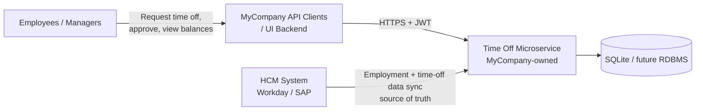
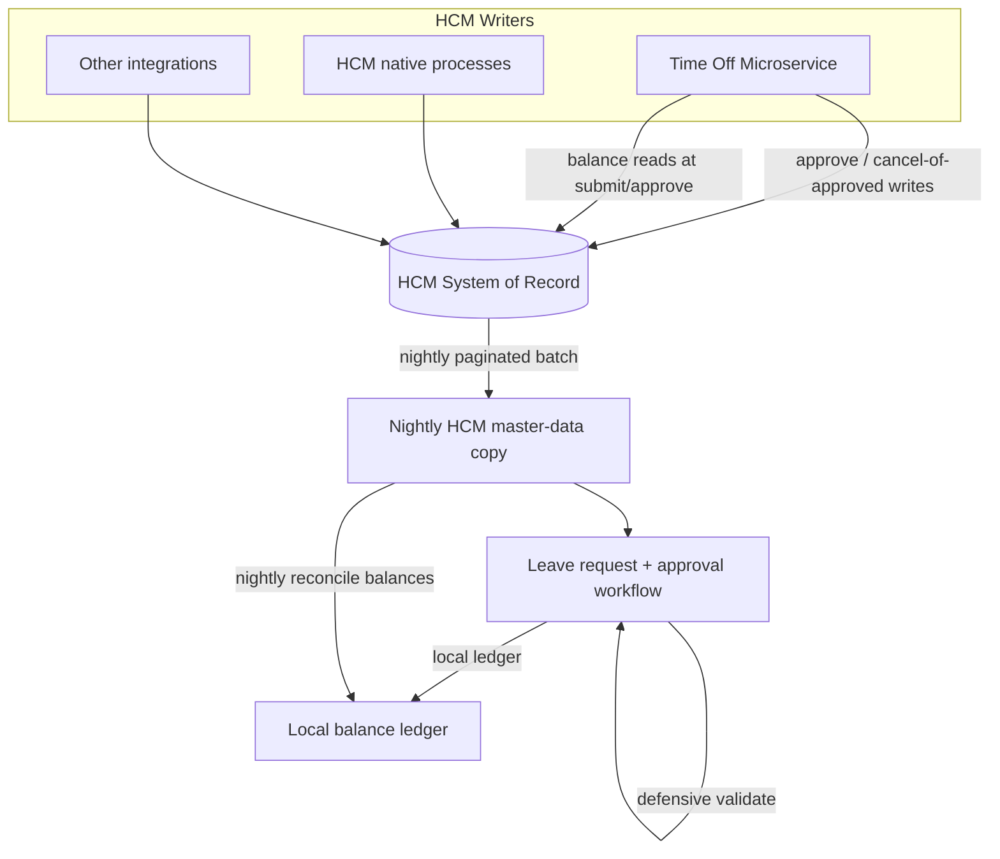
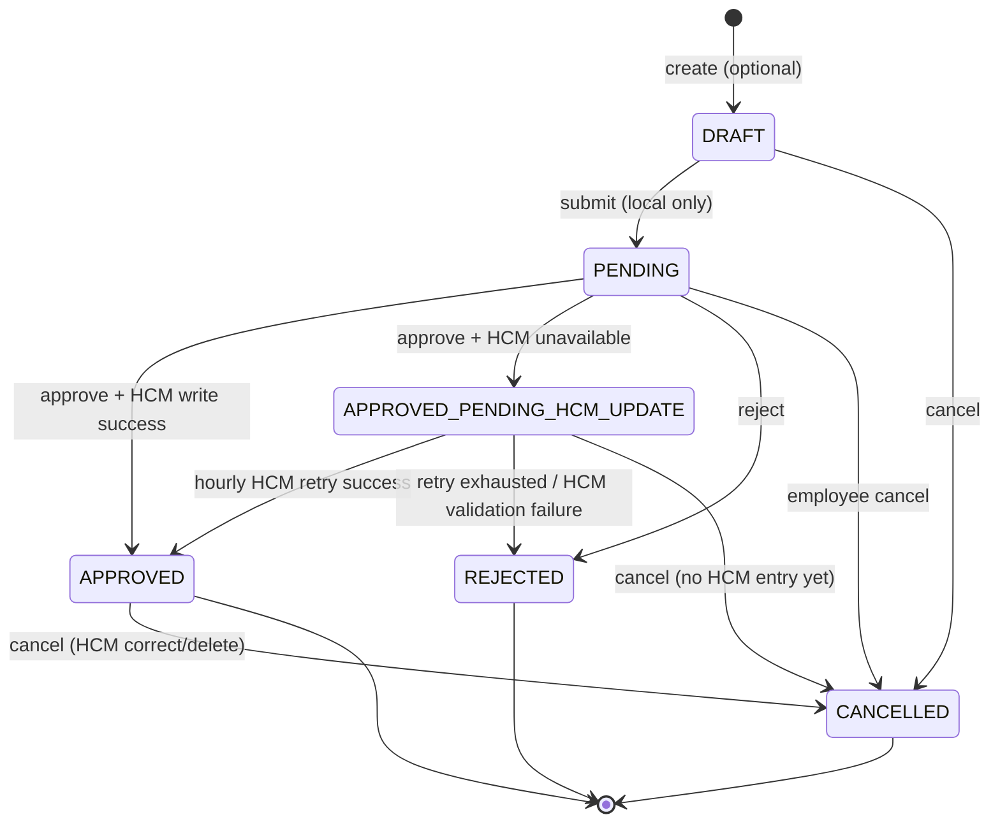

# Time Off Management Microservice — Implementation Specification

**Product owner:** MyCompany  
**Version:** 2.0  
**Status:** Final  
**Source:** Derived from [trd.md](./trd.md) (TRD v1.2)  
**Stack:** Node.js / TypeScript · NestJS · Prisma · SQLite (dev) · JWT · cron  
**HCM adapter (v1):** Workday Absence Management v5 (`docs/hcm/workday/absenceManagement_v5_20260530_oas2.json`)

---

## 1. Purpose

This document translates the Technical Requirements Document (TRD) into an implementation-ready specification for a **MyCompany-owned** microservice. It defines project structure, data models, API contracts, business rules, background jobs, and acceptance tests sufficient to build the service without ambiguity.

MyCompany is the **product owner** of this microservice: MyCompany builds, deploys, and operates it as the time-off workflow boundary within the MyCompany platform. Upstream MyCompany applications consume its API. In this document, **the microservice** refers to the service's runtime behavior; **MyCompany** refers to product ownership, platform context, or organizational responsibility unless stated otherwise.

**Core architectural behavior:** The microservice is the **employee-facing interface for time off** and the **only system of record for approval workflow**—employees submit leave requests, managers approve or reject them entirely within this service, and participants view balances through this API. HCM (Workday Absence Management v5 in v1) remains the **source of truth for employment master data and time-off master data** (balances, accrual, carryover, leave types, policies). The service keeps a **minimal local HCM working copy** refreshed by **nightly batch sync** (employee snapshot + time-off master data only), plus **workflow-owned records** (requests, approvals, notifications, audit, local balance ledger, pending reservations). HCM-sourced snapshot fields are read-only locally; they are never created or updated through time-off APIs.

**Integration constraints:** Submit creates local `pending` workflow state and a pending reservation **without** calling HCM. HCM is called at **approval** time to post the accounting entry (`requestTimeOff`) and at **cancel of approved** entries to correct/delete them (`correctTimeOffEntry`). Submit and approve attempt realtime balance reads from HCM when available, but fall back to the local working copy and ledger when HCM reads fail. When HCM is unavailable during approval, the request moves to `approved_pending_hcm_update` and an hourly job retries the HCM write for up to 24 hours before auto-rejecting. Employment fields are **not** re-fetched from HCM on each request; they come from the nightly employee snapshot. The microservice is **not the only writer to HCM balances**; nightly sync reconciles HCM final balances to a **local balance ledger** via idempotent sync-adjustment entries. Nightly sync does **not** import HCM approval workflow state. HCM validation may be incomplete; the microservice must validate **defensively** before creating pending workflow state and before HCM accounting writes.

Where this spec and the TRD conflict, this spec takes precedence for implementation details; the TRD remains authoritative for product scope and business intent.

---

## 2. System Context



### Division of Responsibility

| Concern | System of Record | Local Copy | Employee Interaction |
|---|---|---|---|
| Leave request workflow | Time Off Microservice | Workflow state | Through the microservice API |
| Approval workflow | Time Off Microservice | Workflow state | Through the microservice API |
| Email (notifications) | HCM | Nightly employee snapshot | Microservice notifications |
| Manager, department, employment status | HCM | Nightly employee snapshot | Through the microservice API |
| Leave types and policies | HCM | Nightly time-off working copy | Through the microservice API |
| Balances, accrual, carryover | HCM | Current balance snapshot | Through the microservice API |
| Local balance ledger | Time Off Microservice | Workflow + reconciliation entries | Reports / balance-ledger API |
| Pending balance reservations | Time Off Microservice | Ledger overlay | Internal |
| Employee name, phone, hire date | HCM | **Not stored** | HCM or upstream apps |

| Actor | Responsibility |
|---|---|
| MyCompany | Product owner; builds, deploys, and operates the Time Off Microservice |
| HCM (Workday v1) | Source of truth for employment and time-off master data; accounting writes after local approval; no REST approve/deny and no approval-workflow sync in v1 |
| Time Off Microservice | MyCompany-owned **employee interface for time-off workflow**—sole owner of approval routing and decisions; leave requests, balance display, nightly master-data sync, local ledger, audit |
| API clients | MyCompany upstream apps and authorized integrations that present the microservice to employees, managers, and HR admins |

Employees **do not** interact with HCM directly. They use applications backed by the microservice. On submit, the microservice validates defensively, optionally reads HCM balances, and creates local pending workflow state without writing to HCM. On approve, the microservice records the approval decision, posts the accounting entry to Workday via `requestTimeOff`, and finalizes local `approved` state on success—or enters `approved_pending_hcm_update` with hourly retries when HCM is unavailable. Reject is local-only. The microservice does not authoritatively manage accrual, carryover, or policy definitions, and does not import HCM approval workflow during nightly sync.

### HCM Integration Challenges

The microservice is MyCompany's HCM integration boundary for time-off. Operational implications:

| Challenge | Implication for the microservice |
|---|---|
| **Multi-writer HCM** | Balances change in HCM without microservice action. Nightly sync reconciles HCM final balances to the local ledger via sync-adjustment entries. |
| **Nightly batch sync (Workday)** | No single batch-corpus endpoint. Aggregate paginated GETs (`/workers`, `/balances`, `/eligibleAbsenceTypes`, etc.) into employee snapshot and time-off master data only. **Do not** import HCM approval queues or workflow state. |
| **Realtime HCM API (Workday)** | Balance reads at submit/approve; post accounting entry at approve (`requestTimeOff`); cancel/correct approved entries (`correctTimeOffEntry`). Optional `timeOffDetails` reads verify posted entries only. **Not** used for per-request employment reads or approval-workflow reconciliation. |
| **Workday approval gap** | No REST approve/deny. All approval UX and workflow state live in the microservice; HCM receives accounting writes only after local approval. |
| **Unreliable HCM rejection** | HCM may accept or reject unexpectedly at approve write. **Defensive local validation is mandatory** before pending workflow creation and before HCM accounting writes; log reconciliation metadata on mismatch. |



---

## 3. Project Structure

```
timeoff-service/
├── prisma/
│   ├── schema.prisma
│   ├── migrations/
│   └── seed.ts
├── src/
│   ├── main.ts                   # NestJS bootstrap
│   ├── app.module.ts             # Root module
│   ├── config/
│   │   └── env.ts                # Validated environment config
│   ├── api/                      # HTTP controllers (flat ApiModule)
│   │   ├── health.controller.ts
│   │   ├── employees.controller.ts
│   │   ├── sync.controller.ts
│   │   ├── sync-runs.controller.ts
│   │   ├── leave-types.controller.ts
│   │   ├── policies.controller.ts
│   │   ├── leave-requests.controller.ts
│   │   ├── approvals.controller.ts
│   │   ├── balances.controller.ts
│   │   └── reports.controller.ts
│   ├── auth/                     # JWT guards, role guards, authorization
│   ├── common/                   # Correlation ID middleware, JSON:API filter
│   ├── prisma/                   # PrismaService module
│   ├── services/
│   │   ├── employee.service.ts
│   │   ├── sync.service.ts
│   │   ├── leave-type.service.ts
│   │   ├── policy.service.ts
│   │   ├── leave-request.service.ts
│   │   ├── approval.service.ts
│   │   ├── balance.service.ts
│   │   ├── ledger.service.ts
│   │   ├── balance-sync.service.ts
│   │   ├── policy-engine.ts
│   │   ├── audit.service.ts
│   │   └── notification.service.ts
│   ├── jobs/
│   │   ├── scheduler.ts
│   │   ├── nightly-hcm-sync.job.ts      # Bootstrap + recurring nightly batch
│   │   ├── approval-reminder.job.ts
│   │   └── hcm-approval-retry.job.ts    # Hourly retry for approved_pending_hcm_update
│   ├── integrations/
│   │   └── hcm/
│   │       ├── types.ts                 # Vendor-neutral HCM types + HcmClient interface
│   │       ├── hcm.factory.ts           # createHcmClient() — provider selection (Phase 3)
│   │       ├── capabilities.ts          # HcmAdapterCapabilities per provider (Phase 3)
│   │       ├── workday/
│   │       │   ├── workday.adapter.ts   # Workday Absence Management v5 (v1 reference adapter)
│   │       │   ├── workday.client.ts
│   │       │   └── error-mapping.ts
│   │       └── stub/
│   │           └── stub.adapter.ts      # In-memory adapter for tests / future provider scaffold (Phase 3)
│   ├── auth/
│   │   ├── roles.ts
│   │   └── guards.ts
│   ├── serializers/
│   │   └── jsonapi/
│   │       ├── document.ts
│   │       └── resources/
│   ├── errors/
│   │   ├── app-error.ts
│   │   └── error-codes.ts
│   └── types/
│       └── index.ts
├── tests/
│   ├── unit/
│   └── integration/
├── package.json
├── tsconfig.json
└── .env.example
```

### Layering Rules

1. **Routes** — Parse/validate input, enforce auth, call services, serialize JSON:API responses. No business logic.
2. **Services** — Domain orchestration, transactions, audit/notification side effects.
3. **Engines** — Pure policy/approval rule evaluation against synced HCM data.
4. **Repositories** — Prisma access only; no HTTP or JSON:API concerns.
5. **Integrations** — HCM client/adapter isolated from domain services. In Phase 1–2, domain code calls Workday through `HcmClient` and routes/jobs may still import `WorkdayAdapter` directly. From Phase 3 onward, all call sites MUST import `createHcmClient()` from `hcm.factory.ts` only; direct imports of any vendor adapter module are prohibited.

---

## 4. Configuration

| Variable | Required | Default | Description |
|---|---|---|---|
| `NODE_ENV` | no | `development` | Runtime environment |
| `PORT` | no | `3000` | HTTP listen port |
| `DATABASE_URL` | yes | `file:./dev.db` | Prisma SQLite URL |
| `JWT_SECRET` | yes | — | HS256 signing secret |
| `JWT_ISSUER` | no | `timeoff-service` | Expected token issuer |
| `JWT_AUDIENCE` | no | `timeoff-api` | Expected token audience |
| `HCM_PROVIDER` | no | `workday` | Active HCM adapter: `workday` (v1), `stub` (tests/scaffold). Future: `sap-successfactors`, etc. |
| `WORKDAY_TENANT_HOSTNAME` | yes* | — | Workday tenant hostname (when `HCM_PROVIDER=workday`) |
| `WORKDAY_CLIENT_ID` | yes* | — | OAuth client ID for Workday |
| `WORKDAY_CLIENT_SECRET` | yes* | — | OAuth client secret |
| `WORKDAY_REFRESH_TOKEN` | yes* | — | OAuth refresh token |
| `CRON_NIGHTLY_HCM_SYNC` | no | `0 2 * * *` | Nightly HCM batch sync (02:00 UTC) |
| `CRON_APPROVAL_REMINDER` | no | `0 9 * * 1-5` | Weekdays 09:00 UTC |
| `CRON_HCM_APPROVAL_RETRY` | no | `0 * * * *` | Hourly retry for `approved_pending_hcm_update` requests |
| `HCM_APPROVAL_RETRY_WINDOW_HOURS` | no | `24` | Max hours to retry HCM approval posts before auto-reject |
| `WORKDAY_SUBMITTED_ACTION_WID` | no | `d9e4223e446c11de98360015c5e6daf6` | Workday API action WID for posting accounting entries at approval |
| `WORKDAY_PREFLIGHT_ENABLED` | no | `true` | Run eligibleAbsenceTypes + validTimeOffDates before approve HCM write |
| `LOG_LEVEL` | no | `info` | Pino log level |

\* Required when HCM integration is enabled.

---

## 5. Data Model (Prisma)

### 5.1 Enums

```prisma
enum EmploymentStatus {
  ACTIVE
  INACTIVE
  TERMINATED
  ON_LEAVE
}

enum LeaveRequestStatus {
  DRAFT
  PENDING
  APPROVED_PENDING_HCM_UPDATE
  APPROVED
  REJECTED
  CANCELLED
}

enum PartialDayType {
  NONE
  AM
  PM
  HOURS
}

enum ApprovalDecision {
  PENDING
  APPROVED
  REJECTED
}

enum LedgerEntryType {
  OPENING_BALANCE
  PENDING_RESERVATION
  CONFIRMED_USAGE
  RESERVATION_RELEASE
  USAGE_REVERSAL
  SYNC_ADJUSTMENT
}

enum LedgerEntrySource {
  WORKFLOW
  HCM_REALTIME_RESPONSE
  HCM_NIGHTLY_RECONCILIATION
}

enum SyncStatus {
  SUCCESS
  PARTIAL
  FAILED
  IN_PROGRESS
}

enum NotificationType {
  REQUEST_SUBMITTED
  REQUEST_APPROVED
  APPROVAL_PENDING_HCM_UPDATE
  HCM_APPROVAL_SYNC_FAILED
  REQUEST_REJECTED
  REQUEST_CANCELLED
  APPROVAL_OVERDUE
  LOW_BALANCE
  SYNC_FAILURE
}

enum AuditAction {
  LEAVE_REQUEST_CREATED
  LEAVE_REQUEST_UPDATED
  LEAVE_REQUEST_CANCELLED
  APPROVAL_DECISION
  BALANCE_ADJUSTMENT
  POLICY_CHANGED
  SYNC_OPERATION
  ADMIN_ACTION
}
```

### 5.2 Core Entities

#### EmployeeHcmMapping (minimal nightly employee snapshot)

Prisma model `EmployeeHcmMapping` (table `employee_hcm_mappings`). Synced from HCM batch data only—**not** a full employment replica. Name, phone, hire date, termination date, employment type, and full location profile are **explicitly not stored**.

| Field | Type | Constraints | Notes |
|---|---|---|---|
| `id` | UUID | PK | Internal identifier |
| `externalEmployeeId` | string | unique, not null | HCM / Workday worker WID |
| `email` | string | not null | **Only contact PII stored locally**; used for notifications |
| `managerExternalEmployeeId` | string? | | HCM manager external ID |
| `managerId` | UUID? | FK → employee_hcm_mappings.id | Resolved after batch upsert |
| `department` | string? | | Org attribute for routing/eligibility |
| `employmentStatus` | EmploymentStatus | not null | |
| `syncCorrelationKey` | string? | | Optional batch correlation value |
| `lastSyncedAt` | DateTime | not null | Snapshot freshness |
| `createdAt` | DateTime | default now | |
| `updatedAt` | DateTime | updatedAt | |

**PII rules:** Email must not appear in logs, audit before/after snapshots, error payloads, or metrics labels. Encrypt at rest where supported. On erasure requests, redact email in place while preserving workflow linkage.

Snapshot fields MUST NOT be writable via API. Updates flow from nightly HCM batch sync only. Departed employees are marked inactive when absent from sync; not hard-deleted while referenced by workflow or audit.

#### TimeOffSyncState

| Field | Type | Notes |
|---|---|---|
| `id` | UUID | PK |
| `syncSource` | string | e.g. `hcm-rest`, `hcm-webhook` |
| `lastSyncStartedAt` | DateTime? | |
| `lastSyncCompletedAt` | DateTime? | |
| `lastSyncStatus` | SyncStatus | |
| `lastSyncCursor` | string? | Incremental cursor/timestamp |
| `errorDetails` | Json? | Failed record summaries |
| `updatedAt` | DateTime | |

#### LeaveType (read-only mirror of HCM)

| Field | Type | Notes |
|---|---|---|
| `id` | UUID | PK |
| `externalLeaveTypeId` | string | unique, HCM leave type ID |
| `code` | string | unique, e.g. `vacation` |
| `name` | string | Display name |
| `description` | string? | |
| `isPaid` | boolean | default true |
| `requiresApproval` | boolean | default true |
| `requiresDocumentation` | boolean | default false |
| `allowPartialDay` | boolean | default true |
| `isActive` | boolean | default true |
| `lastSyncedAt` | DateTime? | |
| `createdAt` / `updatedAt` | DateTime | |

HCM-owned leave type fields MUST NOT be writable via API. Updates flow from HCM time-off sync only.

#### LeavePolicy (read-only mirror of HCM)

| Field | Type | Notes |
|---|---|---|
| `id` | UUID | PK |
| `externalPolicyId` | string | unique, HCM policy ID |
| `leaveTypeId` | UUID | FK |
| `name` | string | |
| `effectiveFrom` | DateTime | |
| `effectiveTo` | DateTime? | null = open-ended |
| `location` | string? | Scope filter |
| `department` | string? | Scope filter |
| `employmentType` | string? | Scope filter |
| `minTenureDays` | int? | Eligibility |
| `isActive` | boolean | |
| `lastSyncedAt` | DateTime? | |

#### LeavePolicyRule

| Field | Type | Notes |
|---|---|---|
| `id` | UUID | PK |
| `policyId` | UUID | FK |
| `ruleType` | string | accrual, carryover, max_balance, negative_balance, approval_routing, eligibility, documentation |
| `config` | Json | Rule-specific payload synced from HCM (see §6.3) |
| `priority` | int | default 0 |

#### LeaveBalance (nightly HCM working-copy snapshot)

Keyed by employee, leave type, and **HCM dimensions** (e.g. `locationId`). `currentBalance` holds HCM's final/current state from nightly sync or successful realtime balance reads. Pending reservations are **not** stored on this row—they are derived from the local ledger.

| Field | Type | Notes |
|---|---|---|
| `id` | UUID | PK |
| `employeeId` | UUID | FK → employee_hcm_mappings |
| `leaveTypeId` | UUID | FK |
| `dimensions` | Json | HCM dimension map, e.g. `{ "locationId": "US-NY" }` |
| `dimensionsHash` | string | Stable hash of normalized dimensions for upsert |
| `currentBalance` | Decimal(10,4) | HCM final/current balance (nightly sync or realtime refresh) |
| `unit` | string | `days` or `hours` |
| `lastSyncedAt` | DateTime? | Last nightly sync or realtime balance read |
| `hcmUpdatedAt` | DateTime? | Timestamp from HCM payload |
| `updatedAt` | DateTime | |

Unique index: `(employeeId, leaveTypeId, dimensionsHash)`.

#### LeaveBalanceLedger (microservice-owned workflow + reconciliation ledger)

**Not** an import of authoritative HCM accounting history. v1 does not sync HCM ledger rows. The local ledger supports workflow, audit, reporting, and nightly reconciliation to HCM final balances.

| Field | Type | Notes |
|---|---|---|
| `id` | UUID | PK |
| `employeeId` | UUID | FK |
| `leaveTypeId` | UUID | FK |
| `dimensions` | Json | Filing dimensions |
| `dimensionsHash` | string | Stable hash for balance key |
| `entryType` | LedgerEntryType | See enum |
| `amount` | Decimal(10,4) | Positive = credit, negative = debit |
| `source` | LedgerEntrySource | `workflow`, `hcm_realtime_response`, `hcm_nightly_reconciliation` |
| `leaveRequestId` | UUID? | FK when workflow-sourced |
| `approvalId` | UUID? | FK when approval-sourced |
| `hcmReferenceId` | string? | Workday time-off entry WID when applicable |
| `syncRunId` | UUID? | FK → sync_runs when sync_adjustment |
| `idempotencyKey` | string? | unique; prevents duplicate ledger writes |
| `effectiveAt` | DateTime | Business effective date |
| `createdAt` | DateTime | |

After each nightly sync, ledger-derived balance for a key must equal HCM `currentBalance`; otherwise append one idempotent `SYNC_ADJUSTMENT` entry per sync run and balance key.

#### LeaveRequest

| Field | Type | Notes |
|---|---|---|
| `id` | UUID | PK |
| `employeeId` | UUID | FK |
| `leaveTypeId` | UUID | FK |
| `startDate` | Date | inclusive |
| `endDate` | Date | inclusive |
| `durationDays` | Decimal(6,2) | Computed at submit from date range, partial-day rules, and holidays; stored on the request |
| `partialDayType` | PartialDayType | default NONE |
| `partialDayHours` | Decimal(4,2)? | When type = HOURS |
| `dimensions` | Json | HCM filing dimensions, e.g. `{ "locationId": "US-NY" }` |
| `status` | LeaveRequestStatus | |
| `reason` | string? | |
| `submittedAt` | DateTime? | Set on submit |
| `cancelledAt` | DateTime? | |
| `hcmReferenceId` | string? | Workday time-off entry WID after successful approve write |
| `hcmPostedAt` | DateTime? | When `requestTimeOff` succeeded at approval |
| `hcmRetryStartedAt` | DateTime? | First failed approve HCM write |
| `hcmRetryDeadlineAt` | DateTime? | End of 24h retry window |
| `hcmRetryCount` | int | default 0 |
| `lastHcmRetryAt` | DateTime? | Last hourly retry attempt |
| `createdAt` / `updatedAt` | DateTime | |

#### Approval

| Field | Type | Notes |
|---|---|---|
| `id` | UUID | PK |
| `leaveRequestId` | UUID | FK |
| `approverEmployeeId` | UUID | FK → employees |
| `approvalLevel` | int | 1-based step order |
| `decision` | ApprovalDecision | default PENDING |
| `comment` | string? | |
| `decidedAt` | DateTime? | |
| `createdAt` | DateTime | |

#### Holiday

| Field | Type | Notes |
|---|---|---|
| `id` | UUID | PK |
| `name` | string | |
| `date` | Date | |
| `location` | string? | null = global; matches `locationId` dimension for duration calculation |
| `isActive` | boolean | |

**v1 management:** Holidays are seeded via `prisma/seed.ts` and are **not** synchronized from HCM in v1. Duration calculations exclude holidays whose `location` matches the employee's filing `locationId` dimension (or global holidays where `location` is null). A future phase may add an admin endpoint or HCM sync; see OQ-9.

#### Notification

| Field | Type | Notes |
|---|---|---|
| `id` | UUID | PK |
| `type` | NotificationType | |
| `recipientEmployeeId` | UUID? | FK |
| `payload` | Json | Event context |
| `deliveredAt` | DateTime? | |
| `createdAt` | DateTime | |

#### AuditLog

| Field | Type | Notes |
|---|---|---|
| `id` | UUID | PK |
| `action` | AuditAction | |
| `actorId` | string? | JWT subject |
| `actorRole` | string? | |
| `resourceType` | string | |
| `resourceId` | string | |
| `before` | Json? | |
| `after` | Json? | |
| `correlationId` | string? | |
| `createdAt` | DateTime | |

#### SyncRun

| Field | Type | Notes |
|---|---|---|
| `id` | UUID | PK |
| `syncType` | string | `bootstrap`, `nightly` |
| `status` | SyncStatus | |
| `correlationId` | string | |
| `startedAt` | DateTime | |
| `completedAt` | DateTime? | |
| `employeeCount` | int? | |
| `balanceCount` | int? | |
| `adjustmentCount` | int? | Sync adjustment ledger entries created |
| `errorDetails` | Json? | |
| `createdAt` | DateTime | |

#### IntegrationEvent

| Field | Type | Notes |
|---|---|---|
| `id` | UUID | PK |
| `source` | string | e.g. `workday` |
| `eventType` | string | e.g. `post_time_off`, `correct_time_off`, `fetch_balances` |
| `payload` | Json | Safe metadata only; no credentials or full HCM payloads in audit |
| `processedAt` | DateTime? | |
| `error` | string? | |
| `createdAt` | DateTime | |

#### IdempotencyKey

| Field | Type | Notes |
|---|---|---|
| `id` | UUID | PK |
| `key` | string | unique |
| `route` | string | |
| `responseBody` | Json | Cached JSON:API response |
| `statusCode` | int | |
| `expiresAt` | DateTime | TTL e.g. 24h |
| `createdAt` | DateTime | |

Used for `POST` mutations that accept `Idempotency-Key` header.

---

## 6. Domain Rules

### 6.1 Nightly HCM Batch Sync (Bootstrap + Recurring)

Initial service bootstrap and recurring nightly sync aggregate paginated Workday GET responses into the employee snapshot and time-off working copy. Workday Absence Management v5 has **no single batch-corpus endpoint**.

**Trigger modes:**
1. Cron (`CRON_NIGHTLY_HCM_SYNC`) — primary schedule
2. `POST /api/v1/sync/time-off` — manual operator trigger (runs the same pipeline)
3. Optional webhook may trigger early master-data reconciliation but does not replace nightly sync and must not drive approval workflow state.

**Workday batch sources (v1):**
- Worker mappings from known `externalEmployeeId` values plus configured worker discovery
- Leave types from `GET /workers/{workerWID}/eligibleAbsenceTypes`
- Current balances from `GET /balances?worker={workerWID}&effective={syncDate}`
- Employee snapshot fields (email, manager, department) may require complementary Workday services outside Absence Management v5 (tenant-specific)

**Algorithm:**
1. Create `sync_runs` row with correlation ID; set status `IN_PROGRESS`.
2. Upsert `employee_hcm_mappings` by `externalEmployeeId` (email, manager, department, employment status, sync correlation key, `lastSyncedAt`).
3. Resolve `managerId` after all employees in the batch are upserted.
4. Upsert leave types, policies, policy rules, and dimensional `leave_balances` from aggregated Workday data.
5. Overwrite `leave_balances.currentBalance` and `hcmUpdatedAt` from HCM final state.
6. For each balance key, compare ledger-derived balance to HCM `currentBalance`:
   - If different, append one idempotent `SYNC_ADJUSTMENT` ledger entry tied to this `syncRunId`.
   - Log externally originated changes when no matching local workflow event exists.
7. Update `time_off_sync_state`; complete `sync_runs` with counts and status.
8. Audit `SYNC_OPERATION`.

**Idempotency:** Safe to retry. At most one sync adjustment per sync run and balance key.

**Conflict resolution:** HCM batch data overwrites employee snapshot and time-off working copy fields. Workflow records, approvals, notifications, audit logs, and existing ledger entries are **never** overwritten by batch data. Nightly sync must **not** import, infer, or overwrite local approval workflow state from HCM.

### 6.2 Defensive Validation

HCM may reject invalid dimension combinations or insufficient balance when filing leave, but **must not be treated as the only validation layer**.

**Required local checks (always):**

| Check | When | Error code |
|---|---|---|
| Dimension set resolves to a local balance row | Submit | `INVALID_TIME_OFF_DIMENSIONS` |
| Leave type active and employee eligible | Submit | `NOT_ELIGIBLE` / `LEAVE_TYPE_NOT_FOUND` |
| Available balance ≥ request duration (if negative not allowed) | Submit | `INSUFFICIENT_BALANCE` |
| Approver resolvable and active in snapshot | Submit | `APPROVER_NOT_FOUND` |
| No overlapping pending/approved/`approved_pending_hcm_update` requests | Submit | `OVERLAPPING_REQUEST` |
| Date range and partial-day rules | Submit | `INVALID_DATE_RANGE`, `INVALID_LEAVE_DAY` |

Available balance formula: `ledgerBalance - pendingBalance`, adjusted by synced policy rules (max/negative). `ledgerBalance` is the sum of local ledger entries; nightly sync ensures it matches HCM `currentBalance` via sync adjustments.

**Workday preflight (when `WORKDAY_PREFLIGHT_ENABLED`, on approve before HCM write):**
1. `GET /workers/{workerWID}/eligibleAbsenceTypes`
2. `GET /workers/{workerWID}/validTimeOffDates?timeOff={absenceTypeWID}&date=...`

**On submit (local pending only):**
1. Run local checks first.
2. Attempt `GET /balances?worker={workerWID}`; fall back to local working copy + ledger when HCM read fails.
3. Optionally run preflight reads when configured.
4. Do **not** call `requestTimeOff`.
5. Persist `PENDING` status and append `PENDING_RESERVATION` ledger entry.
6. Instantiate approval steps and emit `REQUEST_SUBMITTED`.

**On approve (final step):**
1. Record approval decision locally.
2. Retry HCM balance read; re-validate available balance.
3. Optionally run preflight reads.
4. Call `POST /workers/{workerWID}/requestTimeOff` with `multipart/form-data` (`jsonData` part), `businessProcessParameters.action.id` = Submitted WID (API requirement for posting accounting entry; approval already occurred locally).
5. On success: status → `APPROVED`; persist `hcmReferenceId`, `hcmPostedAt`; convert pending reservation to `CONFIRMED_USAGE`; refresh balance from HCM when returned; emit `REQUEST_APPROVED`.
6. On HCM unavailability: status → `APPROVED_PENDING_HCM_UPDATE`; persist retry metadata; emit `APPROVAL_PENDING_HCM_UPDATE`; defer to hourly retry job.
7. On HCM validation error: leave request in `PENDING` (or defined compensating flow); map Workday error codes (see §10.5).

**On reject:**
1. Status → `REJECTED`; append `RESERVATION_RELEASE` ledger entry.
2. Do **not** call HCM.
3. Emit `REQUEST_REJECTED`.

**On cancel of pending or `approved_pending_hcm_update`:**
1. Status → `CANCELLED`; stop retry processing if applicable.
2. Append `RESERVATION_RELEASE`; do **not** call HCM.

**On cancel of approved entry (`hcmReferenceId` present):**
1. Call `POST /workers/{workerWID}/correctTimeOffEntry` with `days[].correctedEntry.id` and `days[].delete=true`.
2. On success: status → `CANCELLED`; append `USAGE_REVERSAL` ledger entry to invert approved usage.
3. Emit `REQUEST_CANCELLED`.

**Principle:** Fail closed locally; HCM realtime validation at approve is supplementary. Nightly sync and optional `timeOffDetails` reads must not drive local approval workflow state.

### 6.3 Leave Request Lifecycle

Employees request time off through the microservice API. Leave request and **approval workflow** are owned exclusively by the microservice. HCM holds employee and balance master data and receives accounting writes after local approval; it does not route or decide approvals. Nightly sync does not import HCM approval workflow state.

On **submit**, the service validates locally, reads HCM balance when reachable (falls back to local working copy + ledger), and creates `PENDING` with a pending reservation—**no HCM write**. On **approve**, the service records the decision, posts to HCM via `requestTimeOff`, and moves to `APPROVED` on success—or `APPROVED_PENDING_HCM_UPDATE` when HCM is unavailable. On **reject**, local state only. On **cancel of approved**, call `correctTimeOffEntry` with `delete=true` and invert ledger usage.



**Validation on create/submit:**

| Rule | Error Code |
|---|---|
| Employee exists and `employmentStatus = ACTIVE` | `EMPLOYEE_INACTIVE` |
| Leave type exists and active | `LEAVE_TYPE_NOT_FOUND` |
| Employee eligible per policy engine | `NOT_ELIGIBLE` |
| `startDate <= endDate` | `INVALID_DATE_RANGE` |
| No overlap with existing PENDING/APPROVED/APPROVED_PENDING_HCM_UPDATE requests | `OVERLAPPING_REQUEST` |
| Sufficient balance if policy disallows negative | `INSUFFICIENT_BALANCE` |
| Dimensions match a known HCM balance row | `INVALID_TIME_OFF_DIMENSIONS` |
| Documentation provided when required | `DOCUMENTATION_REQUIRED` |
| Dates exclude weekends/holidays per policy config | `INVALID_LEAVE_DAY` |

**Duration calculation:**
- Full days: business days between start/end minus holidays (per employee location).
- Partial day: AM/PM = 0.5 day; HOURS = hours / standard day length from policy config (default 8).

**On submit (`PENDING`):**
1. Resolve filing dimensions from request payload (required when HCM needs them).
2. Run defensive validation (§6.2).
3. Compute `durationDays` and persist.
4. Attempt HCM balance read; fall back to local working copy + ledger on failure.
5. Optionally run Workday preflight reads when configured.
6. Do **not** call `requestTimeOff`.
7. Append `PENDING_RESERVATION` ledger entry.
8. Instantiate approval steps from policy engine.
9. Emit `REQUEST_SUBMITTED` notification (email from nightly snapshot).
10. Audit `LEAVE_REQUEST_CREATED`.

**On approve (final step):**
1. Run defensive validation (employment status, approver eligibility, refreshed balance).
2. Record approval decision in `approvals` table.
3. Call Workday `requestTimeOff` to post accounting entry.
4. On HCM success: status → `APPROVED`; persist `hcmReferenceId`, `hcmPostedAt`; append `CONFIRMED_USAGE`; emit `REQUEST_APPROVED`; audit approval.
5. On HCM unavailability: status → `APPROVED_PENDING_HCM_UPDATE`; set `hcmRetryStartedAt`, `hcmRetryDeadlineAt` (+24h), `hcmRetryCount = 0`; emit `APPROVAL_PENDING_HCM_UPDATE`; audit deferral.
6. On HCM validation error: remain `PENDING` (or compensating flow); return mapped error to caller.
7. Do **not** call a Workday approve REST endpoint (none exists in v5).

**Hourly HCM approval retry (`approved_pending_hcm_update`):**
1. Select requests where `hcmRetryDeadlineAt` not passed.
2. Retry balance read + `requestTimeOff`.
3. On success: transition to `APPROVED`; finalize ledger; emit `REQUEST_APPROVED`.
4. On HCM unavailability: increment `hcmRetryCount`; update `lastHcmRetryAt`.
5. On HCM validation failure: transition to `REJECTED`; release reservation; emit `REQUEST_REJECTED`.
6. When deadline reached without success: auto-`REJECTED`; release reservation; emit `HCM_APPROVAL_SYNC_FAILED`.

**On reject:**
1. Status → `REJECTED`.
2. Append `RESERVATION_RELEASE` ledger entry.
3. Do **not** call HCM.
4. Emit `REQUEST_REJECTED` notification.

**On cancel:**
1. Status → `CANCELLED`, set `cancelledAt`.
2. If `APPROVED` with `hcmReferenceId`, call `correctTimeOffEntry` with `delete=true`; append `USAGE_REVERSAL`.
3. If `PENDING` or `APPROVED_PENDING_HCM_UPDATE`, append `RESERVATION_RELEASE` only; stop retry job if applicable.
4. Emit `REQUEST_CANCELLED` notification.

**HCM entry status reads (`timeOffDetails`):** Optional post-write verification only. Must **not** be used to import or reconcile local approval workflow state during nightly sync or background jobs.

### 6.4 Policy Engine (synced HCM rules)

Policy rules are **synced from HCM** and cached locally for validation and approval routing. The microservice does not authoritatively define accrual or balance accounting rules.

Example synced rule payloads in `leave_policy_rules.config`:

**Accrual** (reference/display only; accrual runs in HCM)
```json
{
  "frequency": "monthly",
  "amount": 1.67,
  "unit": "days",
  "prorateOnHire": true,
  "maxAccrualPerPeriod": null
}
```

**Carryover**
```json
{
  "maxCarryoverDays": 5,
  "expiresAfterMonths": 3
}
```

**Max balance**
```json
{ "maxDays": 20 }
```

**Negative balance**
```json
{ "allowed": false, "maxNegativeDays": 0 }
```

**Approval routing** *(multi-step chains and `autoApprove` processing are **Phase 3** features; Phase 1–2 implement single-step manager approval only)*
```json
{
  "steps": [
    { "level": 1, "type": "manager" },
    { "level": 2, "type": "hr", "leaveTypeCodes": ["sick"] }
  ],
  "autoApprove": {
    "maxDurationDays": 1,
    "leaveTypeCodes": ["personal"]
  }
}
```

**Eligibility**
```json
{
  "minTenureDays": 90,
  "employmentTypes": ["full_time"],
  "locations": ["US-NY"]
}
```

**Documentation**
```json
{
  "requiredAfterConsecutiveDays": 3,
  "attachmentTypes": ["medical_certificate"]
}
```

Policy resolution order: most specific match wins (location + department + employment type + tenure), then fallback to broader policies.

### 6.5 Balance Read Model

HCM final balances live in the nightly working copy (`leave_balances.currentBalance`). The **local balance ledger** is the source for workflow-derived balances, pending reservations, and reconciliation.

**Computed values:**

| Metric | Formula |
|---|---|
| `ledgerBalance` | Sum of local `leave_balance_ledger` entries for employee + leave type + dimensions |
| `pendingBalance` | Sum of `PENDING_RESERVATION` minus released amounts for in-flight requests |
| `currentBalance` | HCM final balance from `leave_balances` (nightly sync / realtime refresh) |
| `availableBalance` | `ledgerBalance - pendingBalance`, adjusted by synced policy rules (max/negative) |

After nightly sync, `ledgerBalance` must equal HCM `currentBalance` for each key (via sync adjustments when external HCM activity occurred).

**Balance ledger API** (`GET .../balance-ledger`) returns the microservice-owned workflow and reconciliation ledger—not authoritative HCM accounting history.

**External HCM changes:** Nightly sync appends `SYNC_ADJUSTMENT` when HCM final balance diverges from ledger without a matching workflow event.

**Manual adjustments:** Not supported via microservice API. Performed in HCM; reflected via nightly sync adjustment entries.

### 6.6 Approval Engine

The microservice is the **only** source of approval workflow. HCM does not participate in routing or decision capture for requests submitted through this service.

1. Resolve policy for request's employee + leave type from nightly working copy.
2. Build approval chain:
   - Level 1: employee's `managerId` from nightly snapshot.
   - Higher levels: HR approvers or additional managers per synced policy rules.
3. Reject approvers who are inactive, terminated, or missing from snapshot.
4. **(Phase 3)** Auto-approve if policy `autoApprove` rule matches; skip all approval steps.
5. **(Phase 3)** Multi-step: level N must be APPROVED before level N+1 becomes actionable.
6. Any REJECTED at any level → request REJECTED.
7. Requests in `APPROVED_PENDING_HCM_UPDATE` are not eligible for manual re-approval; they wait for hourly HCM retry or auto-reject.

**Overdue:** Approval pending > 48 business hours triggers `APPROVAL_OVERDUE` notification (cron job). Recipient email from nightly snapshot only—no per-send HCM employment lookup.

---

## 7. Authentication & Authorization

### 7.1 JWT Claims

| Claim | Required | Description |
|---|---|---|
| `sub` | yes | Actor identifier (employee external ID or service ID) |
| `roles` | yes | Array of role strings |
| `employeeId` | conditional | Internal employee UUID when actor is employee/manager |
| `iss` / `aud` | recommended | Validated if configured |
| `exp` | yes | Expiration |

Algorithm: HS256 (dev); support RS256 in production via config without API contract change.

### 7.2 Role Permissions Matrix

| Resource / Action | employee | manager | hr_admin | system_admin | integration_client |
|---|---|---|---|---|---|
| GET own employee | ✓ | ✓ | ✓ | ✓ | — |
| GET direct/indirect reports | — | ✓ | ✓ | ✓ | — |
| GET all employees | — | — | ✓ | ✓ | — |
| GET sync status / sync-runs | — | — | ✓ | ✓ | ✓ |
| POST nightly HCM sync trigger | — | — | — | ✓ | ✓ |
| GET leave types/policies | ✓ | ✓ | ✓ | ✓ | — |
| POST leave request (self) | ✓ | ✓ | ✓ | ✓ | — |
| POST leave request (others) | — | — | ✓ | ✓ | — |
| GET own leave requests | ✓ | ✓ | ✓ | ✓ | — |
| GET team leave requests | — | ✓ | ✓ | ✓ | — |
| Approve/reject | — | ✓* | ✓ | ✓ | — |
| GET balances / ledger | ✓** | ✓** | ✓ | ✓ | — |
| Reports (team/org) | — | ✓ | ✓ | ✓ | — |
| Audit export | — | — | ✓ | ✓ | — |
| POST HCM webhook | — | — | — | — | ✓ |

\* Manager only for direct/indirect reports and when assigned as approver.

\** Scoped to self (employee) or reporting chain (manager).

Authorization enforced via NestJS guards (`JwtAuthGuard`, `RolesGuard`) before service calls.

---

## 8. API Specification

### 8.1 Conventions

- **Base path:** `/api/v1`
- **Content-Type:** `application/vnd.api+json`
- **Accept:** `application/vnd.api+json`
- **Auth header:** `Authorization: Bearer <token>`
- **Idempotency:** `Idempotency-Key: <uuid>` on supported POST endpoints
- **Correlation:** `X-Correlation-Id` accepted; generated if absent; echoed in logs and error `meta`
- **Pagination:** `page[number]`, `page[size]` (default size 25, max 100)
- **Filtering:** `filter[field]=value` (endpoint-specific)
- **Sorting:** `sort=field` or `sort=-field`

### 8.2 Resource Type Registry

| JSON:API `type` | DB Entity | ID Format |
|---|---|---|
| `employees` | EmployeeHcmMapping | UUID |
| `sync-runs` | SyncRun | UUID |
| `leave-requests` | LeaveRequest | UUID |
| `leave-types` | LeaveType | UUID |
| `leave-balances` | LeaveBalance | UUID |
| `leave-balance-ledger-entries` | LeaveBalanceLedger (workflow ledger) | UUID |
| `approvals` | Approval | UUID |
| `policies` | LeavePolicy | UUID |
| `audit-logs` | AuditLog | UUID |

Attribute names in JSON:API responses use **camelCase**.

### 8.3 Endpoint Catalog

#### Health (unauthenticated)

| Method | Path | Description |
|---|---|---|
| GET | `/health/live` | Process alive |
| GET | `/health/ready` | DB + critical deps reachable |

#### Employees (minimal snapshot)

| Method | Path | Auth | Description |
|---|---|---|---|
| GET | `/api/v1/employees/{id}` | self/manager/hr+ | Get employee HCM mapping (no name/phone stored) |

Leave requests MUST reference internal `employeeId`. HCM employee IDs are accepted only in privileged HR-admin or integration flows and must be resolved before persist.

#### Sync

| Method | Path | Auth | Description |
|---|---|---|---|
| POST | `/api/v1/sync/time-off` | system_admin, integration_client | Trigger nightly HCM batch sync (bootstrap or manual) |
| GET | `/api/v1/sync/status` | hr_admin+ | Last sync metadata, staleness, counts |
| GET | `/api/v1/sync-runs` | hr_admin+ | Paginated sync run history |
| GET | `/api/v1/sync-runs/{id}` | hr_admin+ | Single sync run detail |

#### Leave Types (read-only; nightly working copy)

| Method | Path | Auth | Description |
|---|---|---|---|
| GET | `/api/v1/leave-types` | authenticated | List active leave types |

#### Policies (read-only; nightly working copy)

| Method | Path | Auth | Description |
|---|---|---|---|
| GET | `/api/v1/policies` | hr_admin+ | List policies |

#### Leave Requests

Primary **employee-facing** endpoints for requesting time off. All leave request mutations occur in the microservice.

| Method | Path | Auth | Description |
|---|---|---|---|
| POST | `/api/v1/leave-requests` | employee+ | Create (optionally submit) |
| GET | `/api/v1/leave-requests` | scoped | List with filters |
| GET | `/api/v1/leave-requests/{id}` | scoped | Get by ID |
| PATCH | `/api/v1/leave-requests/{id}` | owner/hr+ | Update draft or limited fields |
| POST | `/api/v1/leave-requests/{id}/cancel` | owner/hr+ | Cancel request |

**POST body (JSON:API):**
```json
{
  "data": {
    "type": "leave-requests",
    "attributes": {
      "startDate": "2026-07-10",
      "endDate": "2026-07-12",
      "partialDay": "NONE",
      "reason": "Family travel",
      "submit": true,
      "dimensions": { "locationId": "US-NY" }
    },
    "relationships": {
      "employee": { "data": { "type": "employees", "id": "{employeeId}" } },
      "leaveType": { "data": { "type": "leave-types", "id": "{leaveTypeId}" } }
    }
  }
}
```

**List filters:** `filter[status]` (`draft`, `pending`, `approved_pending_hcm_update`, `approved`, `rejected`, `cancelled`), `filter[employeeId]`, `filter[leaveTypeId]`, `filter[startDate]`, `filter[endDate]`

#### Approvals

| Method | Path | Auth | Description |
|---|---|---|---|
| GET | `/api/v1/approvals/pending` | manager/hr+ | Pending approvals for actor |
| POST | `/api/v1/leave-requests/{id}/approve` | assigned approver | Approve current step |
| POST | `/api/v1/leave-requests/{id}/reject` | assigned approver | Reject request |

**Approve/reject body:**
```json
{
  "data": {
    "type": "approvals",
    "attributes": {
      "comment": "Approved. Coverage arranged."
    }
  }
}
```

#### Balances (HCM working copy + local ledger overlay)

| Method | Path | Auth | Description |
|---|---|---|---|
| GET | `/api/v1/employees/{id}/balances` | scoped | Current balances by leave type |
| GET | `/api/v1/employees/{id}/balance-ledger` | scoped | Microservice workflow + reconciliation ledger (paginated) |

**Balance response attributes:** `currentBalance` (HCM final), `ledgerBalance`, `pendingBalance`, `availableBalance`, `lastSyncedAt`, `unit` (`days` | `hours`)

**Balance ledger response:** workflow and reconciliation entries with `entryType`, `source`, `amount`, `effectiveAt`, optional `leaveRequestId`, `syncRunId`

#### Reports

| Method | Path | Auth | Description |
|---|---|---|---|
| GET | `/api/v1/reports/leave-usage` | manager/hr+ | Usage summary |
| GET | `/api/v1/reports/team-calendar` | manager/hr+ | Team leave calendar |
| GET | `/api/v1/reports/audit` | hr_admin+ | Audit export |

**Report query params:** `filter[startDate]`, `filter[endDate]`, `filter[department]`, `filter[employeeId]`, `filter[teamId]`

Reports return JSON:API collection documents with `meta.summary` for aggregates.

### 8.4 Standard Response Shapes

**Success (single resource):** `jsonapi`, `data` with `type`, `id`, `attributes`, `relationships`.

**Success (collection):**
```json
{
  "jsonapi": { "version": "1.1" },
  "data": [ /* ... */ ],
  "links": {
    "self": "/api/v1/leave-requests?page[number]=1&page[size]=25",
    "next": "/api/v1/leave-requests?page[number]=2&page[size]=25"
  },
  "meta": { "totalCount": 142, "pageNumber": 1, "pageSize": 25 }
}
```

**Error:**
```json
{
  "jsonapi": { "version": "1.1" },
  "errors": [
    {
      "status": "422",
      "code": "INSUFFICIENT_BALANCE",
      "title": "Insufficient balance",
      "detail": "Employee does not have enough vacation balance.",
      "source": { "pointer": "/data/attributes/endDate" }
    }
  ],
  "meta": { "correlationId": "abc-123" }
}
```

### 8.5 HTTP Status Code Mapping

| Status | Usage |
|---|---|
| 200 | Successful GET/PATCH |
| 201 | Successful POST create |
| 204 | Successful cancel with no body (optional; prefer 200 + resource) |
| 400 | Malformed JSON:API document |
| 401 | Missing/invalid JWT |
| 403 | Authenticated but not authorized |
| 404 | Resource not found |
| 409 | Conflict (overlap, duplicate idempotency misuse) |
| 422 | Domain validation failure |
| 503 | HCM unavailable (sync operations) |

### 8.6 Error Code Catalog

| Code | HTTP | Description |
|---|---|---|
| `AUTHENTICATION_REQUIRED` | 401 | Missing or invalid JWT |
| `FORBIDDEN` | 403 | Role insufficient |
| `EMPLOYEE_NOT_FOUND` | 404 | No local mapping for employee (e.g. before nightly sync) |
| `NOT_FOUND` | 404 | Resource missing |
| `VALIDATION_ERROR` | 422 | Schema/field validation |
| `EMPLOYEE_INACTIVE` | 422 | Employee not active |
| `LEAVE_TYPE_NOT_FOUND` | 422 | Invalid leave type |
| `NOT_ELIGIBLE` | 422 | Policy eligibility failed |
| `POLICY_VIOLATION` | 422 | Workday/local policy rule violation |
| `APPROVER_NOT_FOUND` | 422 | Manager/approver missing or inactive in snapshot |
| `INVALID_DATE_RANGE` | 422 | startDate > endDate |
| `OVERLAPPING_REQUEST` | 422 | Conflicting request exists |
| `INSUFFICIENT_BALANCE` | 422 | Balance too low (local defensive check) |
| `INVALID_TIME_OFF_DIMENSIONS` | 422 | No matching HCM balance row for dimension set |
| `HCM_VALIDATION_ERROR` | 422 | HCM rejected filing (invalid combination or rule) |
| `HCM_INSUFFICIENT_BALANCE` | 422 | HCM rejected filing for insufficient balance |
| `DOCUMENTATION_REQUIRED` | 422 | Missing required docs |
| `INVALID_LEAVE_DAY` | 422 | Non-business day not allowed |
| `INVALID_WORKFLOW_TRANSITION` | 422 | e.g. approve cancelled request; Workday A1051 already canceled |
| `APPROVAL_NOT_PENDING` | 422 | No pending approval for actor |
| `HCM_UNAVAILABLE` | 503 | HCM integration failure |
| `SYNC_IN_PROGRESS` | 409 | Concurrent sync blocked |

---

## 9. Background Jobs

| Job | Schedule | Responsibility |
|---|---|---|
| `nightly-hcm-sync` | `CRON_NIGHTLY_HCM_SYNC` | Bootstrap + nightly aggregate Workday batch sync; employee snapshot; time-off master data; ledger reconciliation adjustments. **Does not** import HCM approval workflow. |
| `approval-reminder` | `CRON_APPROVAL_REMINDER` | Notify overdue approvers (email from snapshot) |
| `hcm-approval-retry` | `CRON_HCM_APPROVAL_RETRY` | Retry `requestTimeOff` for `APPROVED_PENDING_HCM_UPDATE` requests hourly for up to `HCM_APPROVAL_RETRY_WINDOW_HOURS`; auto-reject on exhaustion |

**Job execution requirements:**
- Single-instance lock (DB advisory flag or `integration_events` lock row) to prevent duplicate runs.
- Structured log: `{ job, startedAt, completedAt, status, processedCount, errorCount }`.
- Failures increment metrics; do not crash the process.
- Nightly sync is idempotent; at most one sync adjustment per sync run and balance key.

---

## 10. HCM Integration Interface

Domain services, routes, and jobs depend on the vendor-neutral **`HcmClient`** contract only. Vendor-specific HTTP clients, payload shapes, and error codes live in per-provider adapters under `src/integrations/hcm/{provider}/`. **Phase 1–2** ship with `HCM_PROVIDER=workday` as the sole production adapter. **Phase 3** introduces the provider factory and capability model so additional HCM systems (e.g. SAP SuccessFactors) can be added without changing domain services.

### 10.1 Multi-HCM Adapter Abstraction (Phase 3)

| Concern | Rule |
|---|---|
| **Provider selection** | `createHcmClient(config)` in `hcm.factory.ts` resolves the adapter from `HCM_PROVIDER`. Invalid or unsupported values fail fast at startup. |
| **Vendor isolation** | No route, job, or service imports `workday/*` (or future vendor paths) directly. All HCM I/O goes through `HcmClient`. |
| **Neutral types** | Batch sync, balance reads, and accounting writes use types in `integrations/hcm/types.ts` (`EmployeeSnapshot`, `BalanceRow`, `RequestTimeOffPayload`, etc.). Adapters map vendor payloads to/from these types. |
| **Capabilities** | Each adapter exposes `HcmAdapterCapabilities` so domain code can branch on optional features without `if (provider === 'workday')` scattered through services. |
| **Error mapping** | Vendor error codes map to stable service errors (`HCM_VALIDATION_ERROR`, `HCM_INSUFFICIENT_BALANCE`, …) inside the adapter's `error-mapping` module—not in domain services. |
| **Extension** | New providers implement `HcmClient`, register in the factory, and document provider-specific env vars. Domain workflow rules (local approve, no HCM approval sync) remain unchanged. |

```typescript
interface HcmAdapterCapabilities {
  provider: 'workday' | 'stub' | string;
  supportsBatchSync: boolean;
  supportsPreflightValidation: boolean;   // Workday eligibleAbsenceTypes + validTimeOffDates
  supportsWebhookIngest: boolean;
  supportsAccountingWrite: boolean;       // requestTimeOff + correctTimeOffEntry; must be true for
                                          // any adapter used in a production approval workflow
  batchSyncStrategy: 'paginated_aggregate' | 'single_corpus' | 'custom';
}

interface HcmClient {
  readonly capabilities: HcmAdapterCapabilities;

  // Nightly batch aggregation
  fetchEmployeeSnapshots(params: BatchParams): Promise<EmployeeSnapshotPage>;
  fetchEligibleAbsenceTypes(workerExternalId: string): Promise<HcmLeaveType[]>;
  fetchPolicies(workerExternalId: string, leaveTypes: HcmLeaveType[]): Promise<HcmPolicy[]>; // return [] if provider embeds policy in absence types
  fetchBalances(workerExternalId: string, effectiveDate: string): Promise<BalanceRow[]>;

  // Realtime accounting writes — MUST be implemented when capabilities.supportsAccountingWrite is true;
  // adapters where supportsAccountingWrite is false (e.g. read-only test stubs) may throw HcmUnavailableError
  requestTimeOff(workerExternalId: string, payload: RequestTimeOffPayload): Promise<RequestTimeOffResult>;
  correctTimeOffEntry(workerExternalId: string, entryId: string): Promise<void>;

  // Optional realtime helpers — callers MUST check capabilities before invoking
  getValidTimeOffDates?(workerExternalId: string, query: ValidDatesQuery): Promise<ValidDatesResult>;
  getTimeOffDetails?(workerExternalId: string): Promise<TimeOffEntry[]>; // optional post-write verify only
}
```

**Phase 3 deliverables:**
- Move `createHcmClient()` from `workday.adapter.ts` to `hcm.factory.ts`; refactor all call sites to import from the factory.
- `StubAdapter` implementing `HcmClient` with in-memory fixtures for integration tests and as a template for future providers.
- Workday remains the reference production adapter; SAP SuccessFactors (or other targets) are out of scope for Phase 3 implementation but MUST be addable by dropping in a new adapter + factory registration without domain changes.

### 10.2 Workday Reference Adapter (Absence Management v5)

**Base path:** `https://{tenantHostname}/absenceManagement/v5`  
**OpenAPI reference:** `docs/hcm/workday/absenceManagement_v5_20260530_oas2.json`  
**Worker path param:** `{workerWID}` = local `externalEmployeeId`

`WorkdayAdapter` implements `HcmClient` and hides all Workday payloads behind vendor-neutral types.

### 10.3 Workday Endpoint Inventory

| Purpose | Method | Workday endpoint |
|---|---|---|
| Read current balances (submit/approve) | `GET` | `/balances?worker={workerWID}&effective={yyyy-mm-dd}` |
| Post approved time-off accounting entry | `POST` | `/workers/{workerWID}/requestTimeOff` |
| Cancel/correct approved entry | `POST` | `/workers/{workerWID}/correctTimeOffEntry` |
| Eligible absence types (preflight) | `GET` | `/workers/{workerWID}/eligibleAbsenceTypes` |
| Validate dates (preflight) | `GET` | `/workers/{workerWID}/validTimeOffDates` |
| List time-off entries (optional verify) | `GET` | `/workers/{workerWID}/timeOffDetails` |
| Read one entry (optional verify) | `GET` | `/workers/{workerWID}/timeOffDetails/{timeOffEntryWID}` |

Nightly batch aggregates paginated collection responses—there is no single batch-corpus endpoint. Nightly sync must **not** import HCM approval queues or workflow state.

### 10.4 Prescribed Approval Post Flow

Called at **approve** time only. Submit does **not** call Workday.

1. `GET /workers/{workerWID}/eligibleAbsenceTypes` (optional)
2. `GET /workers/{workerWID}/validTimeOffDates?timeOff={absenceTypeWID}&date=...` (optional)
3. `GET /balances?worker={workerWID}&effective={yyyy-mm-dd}`
4. `POST /workers/{workerWID}/requestTimeOff` — `multipart/form-data` with `jsonData` part

Approval JSON must include `days[]` with `date`, `timeOffType.id`, quantity fields, and `businessProcessParameters.action.id` = Submitted WID (`d9e4223e446c11de98360015c5e6daf6` by default). This action WID is an API requirement for posting accounting entries; approval has already occurred in the microservice. On success persist time-off entry WIDs from response `days[]`.

**Cancel of approved:** `correctTimeOffEntry` with `days[].correctedEntry.id` and `days[].delete=true`.

**No REST approve/deny** in Absence Management v5. All approval workflow lives in the microservice. Optional `timeOffDetails` reads verify posted entries only—they must not drive local workflow state. Preflight steps run only when `capabilities.supportsPreflightValidation` is `true` and `WORKDAY_PREFLIGHT_ENABLED` is set.

### 10.5 Workday Error Mapping

| Workday code | Service error |
|---|---|
| `A1011` insufficient balance / not eligible | `HCM_INSUFFICIENT_BALANCE` or `POLICY_VIOLATION` |
| `A1041`, `A1026`, `A1790` worker/position not eligible | `POLICY_VIOLATION` or `EMPLOYEE_INACTIVE` |
| `A1008`, `A1028`, `A1042` overlapping time off | `OVERLAPPING_REQUEST` |
| `A1038`, `A1017`, `A1016`, `A1020` invalid quantity/date | `HCM_VALIDATION_ERROR` |
| `A1051` already canceled | `INVALID_WORKFLOW_TRANSITION` |
| HTTP 401/403 | `HCM_UNAVAILABLE` or auth failure metadata |
| Other critical validation | `HCM_VALIDATION_ERROR` |

Log Workday `error`, `errors[]`, and `code` in integration events—not in audit before/after snapshots.

### 10.6 Retry Policy

- Transient errors (5xx, network): exponential backoff, max 5 attempts.
- Permanent errors (4xx except 429): log and skip record.
- 429: respect `Retry-After` header.

### 10.7 Webhook Support (optional phase)

`POST /api/v1/integrations/hcm/webhook` (integration_client auth):
- Validates signature header.
- Persists raw payload to `integration_events`.
- Processes asynchronously for master-data or balance refresh triggers; returns 202 Accepted.
- Must **not** create, update, or cancel local leave-request workflow state from HCM approval payloads.

---

## 11. Observability

### 11.1 Logging

- Use Pino structured JSON logs.
- Every request log includes: `correlationId`, `method`, `path`, `statusCode`, `durationMs`, `actorId`.
- Domain events log: `action`, `resourceType`, `resourceId`.

### 11.2 Metrics (Prometheus-compatible counters/gauges)

| Metric | Type | Labels |
|---|---|---|
| `http_request_duration_ms` | histogram | method, route, status |
| `http_requests_total` | counter | method, route, status |
| `hcm_sync_total` | counter | domain, status |
| `hcm_sync_duration_ms` | histogram | domain |
| `hcm_approval_retry_total` | counter | outcome |
| `approved_pending_hcm_update_count` | gauge | — |
| `pending_approvals` | gauge | — |
| `cron_job_total` | counter | job, status |
| `hcm_realtime_total` | counter | provider, operation, outcome |
| `sync_adjustment_total` | counter | leave_type |
| `ledger_reconciliation_drift` | gauge | leave_type, dimensions_hash |
| `sync_staleness_seconds` | gauge | — |

### 11.3 Health Checks

- **`/health/live`:** Returns 200 if process running.
- **`/health/ready`:** Returns 200 if Prisma can query DB; 503 otherwise. Optionally check last successful sync age < threshold for integration_client deployments.

---

## 12. Non-Functional Targets

| Category | Target |
|---|---|
| Read latency (p95) | ≤ 500 ms |
| Write latency (p95) | ≤ 1 s |
| Report latency (p95) | ≤ 5 s |
| Availability | 99.9% |
| HCM outage behavior | Workflow reads and last-synced balances remain available; submit/reject proceed with local fallback; approve may enter `approved_pending_hcm_update` with hourly retries; cancel-of-approved HCM writes fail safely |
| Audit retention | Minimum 7 years (configurable) |
| PII | Email only (encrypted at rest where supported); no name/phone/SSN/payroll |

---

## 13. Implementation Phases

### Phase 1 — Foundation (MVP)
- NestJS app, Prisma schema, JWT auth, JSON:API error handling
- Minimal `employee_hcm_mappings` + nightly Workday batch sync (bootstrap + cron); master data only, no HCM approval workflow import
- Time-off working copy (types, policies, dimensional balances)
- Local balance ledger with pending reservations and sync adjustments
- Defensive validation; local submit flow (no HCM write); Workday `requestTimeOff` at approve
- Local single-step manager approval; `approved_pending_hcm_update` + hourly HCM approval retry job
- Health endpoints, audit logging (no email in audit payloads)

**Phase 1 endpoints:** `GET /health/live`, `GET /health/ready`, `GET /api/v1/employees/{id}`, `POST /api/v1/sync/time-off`, `GET /api/v1/sync/status`, `GET /api/v1/leave-types`, `GET /api/v1/policies`, `POST|GET|PATCH /api/v1/leave-requests`, `POST /api/v1/leave-requests/{id}/cancel`, `GET /api/v1/approvals/pending`, `POST /api/v1/leave-requests/{id}/approve`, `POST /api/v1/leave-requests/{id}/reject`, `GET /api/v1/employees/{id}/balances`, `GET /api/v1/employees/{id}/balance-ledger`.

**Phase 1 integration tests** (`tests/integration/` — one file or suite per resource group; every Phase 1 endpoint must have at least one happy-path and one auth/validation test):

| # | Endpoint | Test cases |
|---|---|---|
| IT-1.1 | `GET /health/live` | 200 without auth; process-alive payload |
| IT-1.2 | `GET /health/ready` | 200 when DB reachable; 503 when DB unavailable |
| IT-1.3 | `GET /api/v1/employees/{id}` | 200 for self; 200 for manager viewing report; 403 for unrelated employee; 404 when mapping missing; JSON:API `employees` type; response has no name/phone/hire-date attributes |
| IT-1.4 | `POST /api/v1/sync/time-off` | 200/202 for `system_admin` and `integration_client`; 403 for `employee`/`manager`; upserts employee snapshot, leave types, balances; creates sync metadata; safe to retry (idempotent) |
| IT-1.5 | `GET /api/v1/sync/status` | 200 for `hr_admin+`; 403 for `employee`; returns staleness, last-run status, counts |
| IT-1.6 | `GET /api/v1/leave-types` | 401 without JWT; 200 authenticated; JSON:API collection with pagination `meta`/`links` |
| IT-1.7 | `GET /api/v1/policies` | 200 for `hr_admin+`; 403 for `employee`; returns synced policy resources |
| IT-1.8 | `POST /api/v1/leave-requests` | 201 draft (`submit: false`); 201 submit → `PENDING` + `PENDING_RESERVATION` ledger; 422 insufficient balance / overlap / invalid dimensions; **no** `requestTimeOff` call on submit; 403 when creating for another employee without HR role |
| IT-1.9 | `GET /api/v1/leave-requests` | 200 scoped list for employee (own only); manager sees team; `filter[status]`, `filter[employeeId]` work; pagination |
| IT-1.10 | `GET /api/v1/leave-requests/{id}` | 200 owner/manager/hr; 403 unrelated employee; 404 unknown id |
| IT-1.11 | `PATCH /api/v1/leave-requests/{id}` | 200 update draft fields; 422 patch non-draft; 403 non-owner without HR |
| IT-1.12 | `POST /api/v1/leave-requests/{id}/cancel` | 200 cancel `PENDING` → `CANCELLED` + `RESERVATION_RELEASE`; no HCM call for pending cancel |
| IT-1.13 | `GET /api/v1/approvals/pending` | 200 manager sees assigned pending step; empty collection when none; 403 employee |
| IT-1.14 | `POST /api/v1/leave-requests/{id}/approve` | 200 assigned approver → `APPROVED` + `requestTimeOff` + `CONFIRMED_USAGE` + `hcmReferenceId`; 200 with HCM down → `APPROVED_PENDING_HCM_UPDATE`; 403 non-approver; 422 already terminal |
| IT-1.15 | `POST /api/v1/leave-requests/{id}/reject` | 200 assigned approver → `REJECTED` + `RESERVATION_RELEASE`; no HCM write; 403 non-approver |
| IT-1.16 | `GET /api/v1/employees/{id}/balances` | 200 self/manager/hr; attributes `currentBalance`, `ledgerBalance`, `pendingBalance`, `availableBalance`, `lastSyncedAt`, `unit`; 403 unrelated employee |
| IT-1.17 | `GET /api/v1/employees/{id}/balance-ledger` | 200 paginated workflow entries (`entryType`, `source`, `amount`); includes reservation/usage rows after workflow; 403 unrelated employee |
| IT-1.18 | Cross-cutting | All protected routes return 401 without JWT and JSON:API `errors`; audit records exclude email; hourly retry job promotes `APPROVED_PENDING_HCM_UPDATE` → `APPROVED` (job test with mocked clock) |

### Phase 2 — Workflow Depth
- `correctTimeOffEntry` cancel-of-approved path
- Notifications including `APPROVAL_PENDING_HCM_UPDATE` and `HCM_APPROVAL_SYNC_FAILED`
- Idempotency keys; sync-runs API
- Reports: balances, usage, pending approvals, sync health

**Phase 2 endpoints (new):** `GET /api/v1/sync-runs`, `GET /api/v1/sync-runs/{id}`, `GET /api/v1/reports/leave-usage`, `GET /api/v1/reports/team-calendar`, `GET /api/v1/reports/audit`; plus `Idempotency-Key` header on supported Phase 1 POST mutations.

**Phase 2 integration tests:**

| # | Endpoint / behavior | Test cases |
|---|---|---|
| IT-2.1 | `GET /api/v1/sync-runs` | 200 `hr_admin+` paginated history; 403 employee; `meta.totalCount`; ordered by `startedAt` desc |
| IT-2.2 | `GET /api/v1/sync-runs/{id}` | 200 with adjustment counts and correlation id; 404 unknown run |
| IT-2.3 | `GET /api/v1/reports/leave-usage` | 200 manager/hr with date filters; `meta.summary` aggregates; 403 employee |
| IT-2.4 | `GET /api/v1/reports/team-calendar` | 200 manager team view; respects reporting chain; date-range filter |
| IT-2.5 | `GET /api/v1/reports/audit` | 200 `hr_admin+`; export shape; no email in rows; 403 manager |
| IT-2.6 | `Idempotency-Key` on `POST /api/v1/leave-requests` | Same key + body returns cached 201; different body with same key → 409 |
| IT-2.7 | `Idempotency-Key` on approve/reject/sync | Replay returns identical response; no duplicate ledger/HCM side effects |
| IT-2.8 | `POST .../cancel` (approved) | Calls `correctTimeOffEntry` with `delete=true`; `USAGE_REVERSAL` ledger entry |
| IT-2.9 | `APPROVED_PENDING_HCM_UPDATE` exhaustion | After 24h retries → auto-`REJECTED` + `HCM_APPROVAL_SYNC_FAILED` notification record |
| IT-2.10 | Notifications | `REQUEST_SUBMITTED`, `REQUEST_APPROVED`, `REQUEST_REJECTED`, `APPROVAL_OVERDUE` records created with snapshot email in payload (not in audit) |

### Phase 3 — Operations & Advanced Workflow
- **HCM abstraction:** `HCM_PROVIDER` factory, `HcmAdapterCapabilities`, vendor-neutral `HcmClient`; refactor routes/jobs to import `createHcmClient` from `hcm.factory.ts` only; `StubAdapter` for tests and future provider scaffold
- Multi-step and HR approval; auto-approval from synced policies
- Workday preflight reads at approve (`eligibleAbsenceTypes` + `validTimeOffDates` when `capabilities.supportsPreflightValidation` and `WORKDAY_PREFLIGHT_ENABLED`)
- Optional webhook early master-data reconciliation (must not drive approval workflow)
- Metrics export
- PostgreSQL migration guide
- Complementary Workday services for employee snapshot fields (tenant-specific)

**Phase 3 endpoints (new):** `POST /api/v1/integrations/hcm/webhook` (optional).

**Phase 3 integration tests:**

| # | Endpoint / behavior | Test cases |
|---|---|---|
| IT-3.1 | `POST /api/v1/integrations/hcm/webhook` | 202 for valid `integration_client` signature; 401/403 invalid auth; persists `integration_events`; async master-data refresh only (no approval state mutation) |
| IT-3.2 | Webhook idempotency | Duplicate delivery id does not double-apply sync |
| IT-3.3 | Metrics export | `/metrics` (or configured path) exposes counters from §11.2 when enabled |
| IT-3.4 | Stale sync visibility | Balance and sync-status responses surface `lastSyncedAt` / staleness when nightly sync aged |
| IT-3.5 | HCM outage runbook paths | Manual `POST /api/v1/sync/time-off` recovery after outage; sync status reflects failure then success |
| IT-3.6 | Multi-step approval | Level 2 not actionable until level 1 approved; HR step from policy; auto-approve skips pending approvals |
| IT-3.7 | `POST .../approve` with preflight | Calls `eligibleAbsenceTypes` + `validTimeOffDates` when adapter `supportsPreflightValidation` and `WORKDAY_PREFLIGHT_ENABLED` |
| IT-3.8 | HCM provider abstraction | `HCM_PROVIDER=workday` resolves `WorkdayAdapter`; `HCM_PROVIDER=stub` runs full submit/approve/sync path against in-memory adapter; no route/job imports vendor adapter modules directly |
| IT-3.9 | Adapter capabilities | Approval service skips preflight when `supportsPreflightValidation=false`; webhook handler no-ops when `supportsWebhookIngest=false` |

---

## 14. Testing Requirements

### 14.1 Unit Tests
- Policy engine rule resolution against nightly working copy
- Balance read model (ledger + pending reservations + HCM snapshot)
- Ledger reconciliation and sync-adjustment idempotency
- Approval chain construction from nightly manager snapshot
- Leave duration / overlap detection
- Defensive validation and dimensional balance matching
- HCM factory provider resolution and capability branching (Phase 3)
- Workday error code mapping (adapter-local)
- JSON:API serializers

### 14.2 Integration Tests

Endpoint coverage is defined per implementation phase in **§13** (IT-1.x through IT-3.x). The scenarios below are cross-phase workflow tests that span multiple endpoints; each must be implemented in addition to the per-endpoint Phase 1 matrix.
- Submit happy path: validate → local `PENDING` + pending ledger entry → no `requestTimeOff` call
- Submit with HCM balance read failure: falls back to local working copy + ledger and still creates pending workflow
- Approve happy path: local approve → `requestTimeOff` → `APPROVED` + `CONFIRMED_USAGE`
- Approve with HCM unavailable: transitions to `APPROVED_PENDING_HCM_UPDATE`; hourly retry succeeds → `APPROVED`
- Exhausted HCM approval retries: auto-`REJECTED` + `RESERVATION_RELEASE` + `HCM_APPROVAL_SYNC_FAILED` notification
- Reject: local only; no HCM call; `RESERVATION_RELEASE`
- Cancel approved: `correctTimeOffEntry` + `USAGE_REVERSAL`
- Cancel pending / `approved_pending_hcm_update`: local only; no HCM call
- Nightly sync upsert for multi-dimensional balances; sync adjustment when HCM final ≠ ledger; sync does not mutate workflow state
- No Workday approve REST call; approval workflow sourced only from microservice
- Bootstrap + nightly sync idempotency
- `EMPLOYEE_NOT_FOUND` when mapping missing before sync
- Authorization matrix spot checks per role
- Audit logs exclude email
- JSON:API schema validation on all public endpoints

### 14.3 Acceptance Criteria (from TRD v1.2)

| # | Criterion | Verification |
|---|---|---|
| AC-1 | JSON:API v1.1 responses | Contract tests on all endpoints |
| AC-2 | JWT auth on protected routes | 401/403 tests |
| AC-3 | Employees submit/view/cancel via microservice | Integration test suite |
| AC-4 | Approval workflow sourced only from microservice; nightly sync does not import HCM approval state | Sync + workflow isolation tests |
| AC-5 | Submit creates local pending state without `requestTimeOff` | Integration test with mocked Workday |
| AC-6 | Approve uses `requestTimeOff` with Submitted action WID after local approval | Adapter contract test |
| AC-7 | `approved_pending_hcm_update` hourly retry for 24h; auto-reject on exhaustion | Job integration test |
| AC-8 | Reject is local-only; no HCM write | Integration test |
| AC-9 | Cancel approved uses `correctTimeOffEntry` with `delete=true` + ledger reversal | Integration test |
| AC-10 | Defensive validation before submit and before HCM writes; local fallback when HCM reads fail at submit | Pre-submit and outage tests |
| AC-11 | Bootstrap + nightly batch sync (master data only) | Sync replay test |
| AC-12 | Minimal employee snapshot only (no name/phone/hire date) | Schema + API tests |
| AC-13 | Local balance ledger + nightly sync adjustments | Ledger reconciliation test |
| AC-14 | Notifications use snapshot email only | Unit test; no HCM employment read at send |
| AC-15 | HCM owns balances/accrual/policies | No local accrual APIs; sync overwrites working copy |
| AC-16 | Workflow state locally owned | Sync does not mutate requests/approvals/ledger history |
| AC-17 | HCM outage: submit/reject proceed locally; approve defers to retry state | Failure injection test |
| AC-18 | Audit excludes email and sensitive HCM payloads | Audit snapshot inspection |

---

## 15. Open Questions

| ID | Question | Default Assumption |
|---|---|---|
| OQ-1 | Standard work hours per location? | 8 hours/day globally unless policy overrides |
| OQ-2 | Workday services for email/manager/department in nightly snapshot? | Tenant-specific; document per deployment |
| OQ-3 | Attachment storage for documentation? | Store metadata URL only in v1; no blob storage |
| OQ-4 | Draft requests enabled? | Yes, optional via `submit: false` |
| OQ-5 | RS256 JWT in production? | Supported via config; HS256 for dev |
| OQ-6 | `wd-warning-action: updateonwarning` on Workday warnings? | Off by default; enable only when product policy allows |
| OQ-7 | Auto-cancel pending requests when sync adjustment drops available balance? | No in v1; surface warning only |
| OQ-8 | HCM webhook signature scheme? | HMAC-SHA256 of raw body (optional phase) |
| OQ-9 | Holiday management: source (seed, admin API, or HCM sync), per-location coverage, and update process? | Seeded via `seed.ts` in v1; no HCM sync; no admin endpoint in v1 |

---

## 16. Document History

| Version | Date | Changes |
|---|---|---|
| 1.0 | 2026-06-06 | Initial spec derived from TRD |
| 1.1 | 2026-06-06 | Clarified microservice as employee time-off interface; HCM as employment data source of truth |
| 1.2 | 2026-06-06 | HCM as source of truth for time-off master data (balances, accrual, policies); workflow remains in microservice |
| 1.3 | 2026-06-06 | Multi-writer HCM, batch + realtime APIs, dimensional balances, defensive validation |
| 1.4 | 2026-06-06 | Clarified MyCompany as product owner; operational behavior attributed to the microservice |
| 1.5 | 2026-06-06 | Aligned with TRD v2: minimal employee snapshot, nightly Workday batch sync, local balance ledger, submit-on-request Workday flow, local approve/reconcile, no HCM ledger import |
| 1.6 | 2026-06-06 | Aligned with TRD v2 workflow model: local submit without HCM write; HCM post at approve; `approved_pending_hcm_update` hourly retry; microservice-only approval workflow; no HCM approval sync in nightly batch |
| 1.7 | 2026-06-06 | Per-phase integration test matrices (IT-1.x–IT-3.x) covering all endpoints introduced in each phase |
| 1.8 | 2026-06-07 | Moved multi-step/HR/auto approval and Workday preflight from Phase 2 to Phase 3 (IT-3.6, IT-3.7); renumbered Phase 2 integration tests IT-2.8–IT-2.10 |
| 1.9 | 2026-06-08 | Phase 3 HCM abstraction: `HCM_PROVIDER` factory, `HcmAdapterCapabilities`, vendor-neutral `HcmClient` (§10.1), `StubAdapter`, IT-3.8–IT-3.9 |
| 2.0 | 2026-06-08 | Critical/medium editorial pass: Layering Rule 5 phase boundary clarified; §6.1b→§6.2 + cascade; §10.0→§10.1 + cascade; duplicate `workday_realtime_total` removed; `HcmClient` interface fixed (`fetchPolicies` required, `supportsAccountingWrite` guard note); Phase 3 markers on multi-step/auto-approve (§6.4, §6.6); webhook row in roles matrix; OQ-9 holiday management; Holiday entity v1 management note; TRD version reference corrected to v1.2 |
